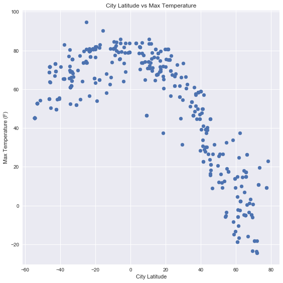
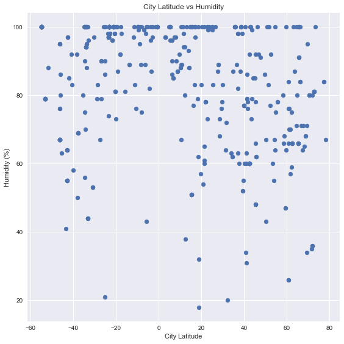
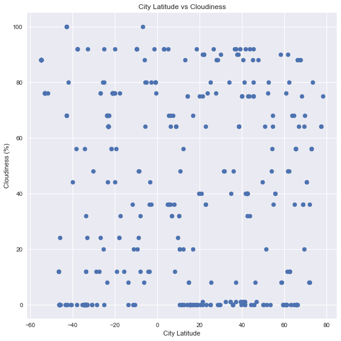
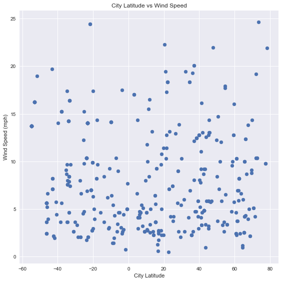

# Analysis

Trends Observed (Temperatrues taken on 2/27/2018):
* Cities with higher temperatures are located close to the Equator
* Temperatures drop as you move towards the poles but the drop is more pronounced in the north hemisphere (at least on february when it is winter in the north)
* Cloudiness, Wind Speed and Humidity did not show much of a correlation with Latitude

Import dependencies


```python
from citipy import citipy
#local config file with API key
import config
import matplotlib.pyplot as plt
import pandas as pd
import random as rnd
import requests as req
import seaborn as sns
sns.set()
rnd.seed(12456)
```

### Generate Cities List

Get random grid of 22*23 points in (latitude, longitude) 

Latitude range: -90, 90

Longitude range: -180, 180


```python
cities = []
for i in range(22):
    for j in range(23):
        lat = rnd.uniform(-90, 90)
        lon = rnd.uniform(-180, 180)
        cities.append(citipy.nearest_city(lat, lon).city_name)
```

### Perform API Calls


```python
API_KEY = config.API_KEY
latitudes_df = pd.DataFrame(columns=['City', 'Latitude', 'Max Temperature', 'Humidity', 'Cloudiness', 'Wind Speed'])
for indx, city in enumerate(cities):
    url = f'http://api.openweathermap.org/data/2.5/weather?q={city}&appid={API_KEY}&units=imperial'
    try:
        response = req.get(url)
    except:
        print(f'Query: {url} failed!')
        continue
    if response.status_code != 200:
        print(f'City: {city} not found!')
        continue
    print(f'Processing record: {indx}; City: {city};\nURL: {url}')
    r_json = response.json()
    latitude = r_json['coord']['lat']
    temperature = r_json['main']['temp_max'] 
    humidity = r_json['main']['humidity']
    cloudiness = r_json['clouds']['all']
    wind_speed = r_json['wind']['speed'] 
    latitudes_df.loc[indx, 'City'] = city
    latitudes_df.loc[indx, 'Latitude'] = latitude
    latitudes_df.loc[indx, 'Max Temperature'] = temperature
    latitudes_df.loc[indx, 'Humidity'] = humidity
    latitudes_df.loc[indx, 'Cloudiness'] = cloudiness
    latitudes_df.loc[indx, 'Wind Speed'] = wind_speed    
```

    City: illoqqortoormiut not found!
    Processing record: 1; City: artyshta;
    URL: http://api.openweathermap.org/data/2.5/weather?q=artyshta&appid=c4c7cd621b32b64dab8036d138681984&units=imperial
    Processing record: 2; City: nanakuli;
    URL: http://api.openweathermap.org/data/2.5/weather?q=nanakuli&appid=c4c7cd621b32b64dab8036d138681984&units=imperial
    Processing record: 3; City: cherskiy;
    URL: http://api.openweathermap.org/data/2.5/weather?q=cherskiy&appid=c4c7cd621b32b64dab8036d138681984&units=imperial
    Processing record: 4; City: jiuquan;
    URL: http://api.openweathermap.org/data/2.5/weather?q=jiuquan&appid=c4c7cd621b32b64dab8036d138681984&units=imperial
    Processing record: 5; City: bambanglipuro;
    URL: http://api.openweathermap.org/data/2.5/weather?q=bambanglipuro&appid=c4c7cd621b32b64dab8036d138681984&units=imperial
    Processing record: 6; City: ushuaia;
    URL: http://api.openweathermap.org/data/2.5/weather?q=ushuaia&appid=c4c7cd621b32b64dab8036d138681984&units=imperial
    City: vaitupu not found!
    Processing record: 8; City: guerrero negro;
    URL: http://api.openweathermap.org/data/2.5/weather?q=guerrero negro&appid=c4c7cd621b32b64dab8036d138681984&units=imperial
    Processing record: 9; City: luang prabang;
    URL: http://api.openweathermap.org/data/2.5/weather?q=luang prabang&appid=c4c7cd621b32b64dab8036d138681984&units=imperial
    Processing record: 10; City: puerto madero;
    URL: http://api.openweathermap.org/data/2.5/weather?q=puerto madero&appid=c4c7cd621b32b64dab8036d138681984&units=imperial
    Processing record: 11; City: lavrentiya;
    URL: http://api.openweathermap.org/data/2.5/weather?q=lavrentiya&appid=c4c7cd621b32b64dab8036d138681984&units=imperial
    Processing record: 12; City: kiama;
    URL: http://api.openweathermap.org/data/2.5/weather?q=kiama&appid=c4c7cd621b32b64dab8036d138681984&units=imperial
    Processing record: 13; City: atuona;
    URL: http://api.openweathermap.org/data/2.5/weather?q=atuona&appid=c4c7cd621b32b64dab8036d138681984&units=imperial
    Processing record: 14; City: severo-kurilsk;
    URL: http://api.openweathermap.org/data/2.5/weather?q=severo-kurilsk&appid=c4c7cd621b32b64dab8036d138681984&units=imperial
    Processing record: 15; City: rikitea;
    URL: http://api.openweathermap.org/data/2.5/weather?q=rikitea&appid=c4c7cd621b32b64dab8036d138681984&units=imperial
    Processing record: 16; City: jamestown;
    URL: http://api.openweathermap.org/data/2.5/weather?q=jamestown&appid=c4c7cd621b32b64dab8036d138681984&units=imperial
    Processing record: 17; City: bismarck;
    URL: http://api.openweathermap.org/data/2.5/weather?q=bismarck&appid=c4c7cd621b32b64dab8036d138681984&units=imperial
    Processing record: 18; City: punta arenas;
    URL: http://api.openweathermap.org/data/2.5/weather?q=punta arenas&appid=c4c7cd621b32b64dab8036d138681984&units=imperial
    Processing record: 19; City: los llanos de aridane;
    URL: http://api.openweathermap.org/data/2.5/weather?q=los llanos de aridane&appid=c4c7cd621b32b64dab8036d138681984&units=imperial
    Processing record: 20; City: nesna;
    URL: http://api.openweathermap.org/data/2.5/weather?q=nesna&appid=c4c7cd621b32b64dab8036d138681984&units=imperial
    Processing record: 21; City: ushuaia;
    URL: http://api.openweathermap.org/data/2.5/weather?q=ushuaia&appid=c4c7cd621b32b64dab8036d138681984&units=imperial
    Processing record: 22; City: champerico;
    URL: http://api.openweathermap.org/data/2.5/weather?q=champerico&appid=c4c7cd621b32b64dab8036d138681984&units=imperial
    Processing record: 23; City: mataura;
    URL: http://api.openweathermap.org/data/2.5/weather?q=mataura&appid=c4c7cd621b32b64dab8036d138681984&units=imperial
    Processing record: 24; City: pontal do parana;
    URL: http://api.openweathermap.org/data/2.5/weather?q=pontal do parana&appid=c4c7cd621b32b64dab8036d138681984&units=imperial
    Processing record: 25; City: tual;
    URL: http://api.openweathermap.org/data/2.5/weather?q=tual&appid=c4c7cd621b32b64dab8036d138681984&units=imperial
    Processing record: 26; City: ushuaia;
    URL: http://api.openweathermap.org/data/2.5/weather?q=ushuaia&appid=c4c7cd621b32b64dab8036d138681984&units=imperial
    Processing record: 27; City: ushuaia;
    URL: http://api.openweathermap.org/data/2.5/weather?q=ushuaia&appid=c4c7cd621b32b64dab8036d138681984&units=imperial
    Processing record: 28; City: tayga;
    URL: http://api.openweathermap.org/data/2.5/weather?q=tayga&appid=c4c7cd621b32b64dab8036d138681984&units=imperial
    Processing record: 29; City: thompson;
    URL: http://api.openweathermap.org/data/2.5/weather?q=thompson&appid=c4c7cd621b32b64dab8036d138681984&units=imperial
    Processing record: 30; City: mataura;
    URL: http://api.openweathermap.org/data/2.5/weather?q=mataura&appid=c4c7cd621b32b64dab8036d138681984&units=imperial
    City: taolanaro not found!
    Processing record: 32; City: faya;
    URL: http://api.openweathermap.org/data/2.5/weather?q=faya&appid=c4c7cd621b32b64dab8036d138681984&units=imperial
    Processing record: 33; City: marsh harbour;
    URL: http://api.openweathermap.org/data/2.5/weather?q=marsh harbour&appid=c4c7cd621b32b64dab8036d138681984&units=imperial
    Processing record: 34; City: eydhafushi;
    URL: http://api.openweathermap.org/data/2.5/weather?q=eydhafushi&appid=c4c7cd621b32b64dab8036d138681984&units=imperial
    City: palabuhanratu not found!
    Processing record: 36; City: iqaluit;
    URL: http://api.openweathermap.org/data/2.5/weather?q=iqaluit&appid=c4c7cd621b32b64dab8036d138681984&units=imperial
    Processing record: 37; City: pevek;
    URL: http://api.openweathermap.org/data/2.5/weather?q=pevek&appid=c4c7cd621b32b64dab8036d138681984&units=imperial
    Processing record: 38; City: charters towers;
    URL: http://api.openweathermap.org/data/2.5/weather?q=charters towers&appid=c4c7cd621b32b64dab8036d138681984&units=imperial
    Processing record: 39; City: esperance;
    URL: http://api.openweathermap.org/data/2.5/weather?q=esperance&appid=c4c7cd621b32b64dab8036d138681984&units=imperial
    Processing record: 40; City: ushuaia;
    URL: http://api.openweathermap.org/data/2.5/weather?q=ushuaia&appid=c4c7cd621b32b64dab8036d138681984&units=imperial
    Processing record: 41; City: bluff;
    URL: http://api.openweathermap.org/data/2.5/weather?q=bluff&appid=c4c7cd621b32b64dab8036d138681984&units=imperial
    Processing record: 42; City: rikitea;
    URL: http://api.openweathermap.org/data/2.5/weather?q=rikitea&appid=c4c7cd621b32b64dab8036d138681984&units=imperial
    Processing record: 43; City: butaritari;
    URL: http://api.openweathermap.org/data/2.5/weather?q=butaritari&appid=c4c7cd621b32b64dab8036d138681984&units=imperial
    Processing record: 44; City: puerto ayora;
    URL: http://api.openweathermap.org/data/2.5/weather?q=puerto ayora&appid=c4c7cd621b32b64dab8036d138681984&units=imperial
    Processing record: 45; City: beipiao;
    URL: http://api.openweathermap.org/data/2.5/weather?q=beipiao&appid=c4c7cd621b32b64dab8036d138681984&units=imperial
    Processing record: 46; City: puerto ayora;
    URL: http://api.openweathermap.org/data/2.5/weather?q=puerto ayora&appid=c4c7cd621b32b64dab8036d138681984&units=imperial
    Processing record: 47; City: khatanga;
    URL: http://api.openweathermap.org/data/2.5/weather?q=khatanga&appid=c4c7cd621b32b64dab8036d138681984&units=imperial
    Processing record: 48; City: puerto ayora;
    URL: http://api.openweathermap.org/data/2.5/weather?q=puerto ayora&appid=c4c7cd621b32b64dab8036d138681984&units=imperial
    Processing record: 49; City: yulara;
    URL: http://api.openweathermap.org/data/2.5/weather?q=yulara&appid=c4c7cd621b32b64dab8036d138681984&units=imperial
    City: inderborskiy not found!
    Processing record: 51; City: arlit;
    URL: http://api.openweathermap.org/data/2.5/weather?q=arlit&appid=c4c7cd621b32b64dab8036d138681984&units=imperial
    Processing record: 52; City: kodiak;
    URL: http://api.openweathermap.org/data/2.5/weather?q=kodiak&appid=c4c7cd621b32b64dab8036d138681984&units=imperial
    Processing record: 53; City: mago;
    URL: http://api.openweathermap.org/data/2.5/weather?q=mago&appid=c4c7cd621b32b64dab8036d138681984&units=imperial
    Processing record: 54; City: hervey bay;
    URL: http://api.openweathermap.org/data/2.5/weather?q=hervey bay&appid=c4c7cd621b32b64dab8036d138681984&units=imperial
    Processing record: 55; City: bathsheba;
    URL: http://api.openweathermap.org/data/2.5/weather?q=bathsheba&appid=c4c7cd621b32b64dab8036d138681984&units=imperial
    Processing record: 56; City: ushuaia;
    URL: http://api.openweathermap.org/data/2.5/weather?q=ushuaia&appid=c4c7cd621b32b64dab8036d138681984&units=imperial
    Processing record: 57; City: rikitea;
    URL: http://api.openweathermap.org/data/2.5/weather?q=rikitea&appid=c4c7cd621b32b64dab8036d138681984&units=imperial
    City: amderma not found!
    Processing record: 59; City: caloundra;
    URL: http://api.openweathermap.org/data/2.5/weather?q=caloundra&appid=c4c7cd621b32b64dab8036d138681984&units=imperial
    Processing record: 60; City: buchin;
    URL: http://api.openweathermap.org/data/2.5/weather?q=buchin&appid=c4c7cd621b32b64dab8036d138681984&units=imperial
    Processing record: 61; City: new norfolk;
    URL: http://api.openweathermap.org/data/2.5/weather?q=new norfolk&appid=c4c7cd621b32b64dab8036d138681984&units=imperial
    Processing record: 62; City: vaini;
    URL: http://api.openweathermap.org/data/2.5/weather?q=vaini&appid=c4c7cd621b32b64dab8036d138681984&units=imperial
    Processing record: 63; City: norman wells;
    URL: http://api.openweathermap.org/data/2.5/weather?q=norman wells&appid=c4c7cd621b32b64dab8036d138681984&units=imperial
    Processing record: 64; City: norman wells;
    URL: http://api.openweathermap.org/data/2.5/weather?q=norman wells&appid=c4c7cd621b32b64dab8036d138681984&units=imperial
    Processing record: 65; City: omboue;
    URL: http://api.openweathermap.org/data/2.5/weather?q=omboue&appid=c4c7cd621b32b64dab8036d138681984&units=imperial
    City: mys shmidta not found!
    Processing record: 67; City: vaini;
    URL: http://api.openweathermap.org/data/2.5/weather?q=vaini&appid=c4c7cd621b32b64dab8036d138681984&units=imperial
    Processing record: 68; City: tak;
    URL: http://api.openweathermap.org/data/2.5/weather?q=tak&appid=c4c7cd621b32b64dab8036d138681984&units=imperial
    Processing record: 69; City: port alfred;
    URL: http://api.openweathermap.org/data/2.5/weather?q=port alfred&appid=c4c7cd621b32b64dab8036d138681984&units=imperial
    Processing record: 70; City: wasilla;
    URL: http://api.openweathermap.org/data/2.5/weather?q=wasilla&appid=c4c7cd621b32b64dab8036d138681984&units=imperial
    Processing record: 71; City: nantucket;
    URL: http://api.openweathermap.org/data/2.5/weather?q=nantucket&appid=c4c7cd621b32b64dab8036d138681984&units=imperial
    Processing record: 72; City: osorno;
    URL: http://api.openweathermap.org/data/2.5/weather?q=osorno&appid=c4c7cd621b32b64dab8036d138681984&units=imperial
    Processing record: 73; City: hobart;
    URL: http://api.openweathermap.org/data/2.5/weather?q=hobart&appid=c4c7cd621b32b64dab8036d138681984&units=imperial
    Processing record: 74; City: albany;
    URL: http://api.openweathermap.org/data/2.5/weather?q=albany&appid=c4c7cd621b32b64dab8036d138681984&units=imperial
    Processing record: 75; City: jamestown;
    URL: http://api.openweathermap.org/data/2.5/weather?q=jamestown&appid=c4c7cd621b32b64dab8036d138681984&units=imperial
    Processing record: 76; City: baykit;
    URL: http://api.openweathermap.org/data/2.5/weather?q=baykit&appid=c4c7cd621b32b64dab8036d138681984&units=imperial
    Processing record: 77; City: san juan;
    URL: http://api.openweathermap.org/data/2.5/weather?q=san juan&appid=c4c7cd621b32b64dab8036d138681984&units=imperial
    Processing record: 78; City: busselton;
    URL: http://api.openweathermap.org/data/2.5/weather?q=busselton&appid=c4c7cd621b32b64dab8036d138681984&units=imperial
    Processing record: 79; City: narsaq;
    URL: http://api.openweathermap.org/data/2.5/weather?q=narsaq&appid=c4c7cd621b32b64dab8036d138681984&units=imperial
    City: belushya guba not found!
    Processing record: 81; City: caravelas;
    URL: http://api.openweathermap.org/data/2.5/weather?q=caravelas&appid=c4c7cd621b32b64dab8036d138681984&units=imperial
    Processing record: 82; City: rikitea;
    URL: http://api.openweathermap.org/data/2.5/weather?q=rikitea&appid=c4c7cd621b32b64dab8036d138681984&units=imperial
    City: olafsvik not found!
    Processing record: 84; City: poum;
    URL: http://api.openweathermap.org/data/2.5/weather?q=poum&appid=c4c7cd621b32b64dab8036d138681984&units=imperial
    Processing record: 85; City: rikitea;
    URL: http://api.openweathermap.org/data/2.5/weather?q=rikitea&appid=c4c7cd621b32b64dab8036d138681984&units=imperial
    Processing record: 86; City: jamestown;
    URL: http://api.openweathermap.org/data/2.5/weather?q=jamestown&appid=c4c7cd621b32b64dab8036d138681984&units=imperial
    Processing record: 87; City: victoria;
    URL: http://api.openweathermap.org/data/2.5/weather?q=victoria&appid=c4c7cd621b32b64dab8036d138681984&units=imperial
    City: zolotinka not found!
    Processing record: 89; City: atuona;
    URL: http://api.openweathermap.org/data/2.5/weather?q=atuona&appid=c4c7cd621b32b64dab8036d138681984&units=imperial
    Processing record: 90; City: georgetown;
    URL: http://api.openweathermap.org/data/2.5/weather?q=georgetown&appid=c4c7cd621b32b64dab8036d138681984&units=imperial
    City: belushya guba not found!
    Processing record: 92; City: rundu;
    URL: http://api.openweathermap.org/data/2.5/weather?q=rundu&appid=c4c7cd621b32b64dab8036d138681984&units=imperial
    Processing record: 93; City: rikitea;
    URL: http://api.openweathermap.org/data/2.5/weather?q=rikitea&appid=c4c7cd621b32b64dab8036d138681984&units=imperial
    Processing record: 94; City: cognac;
    URL: http://api.openweathermap.org/data/2.5/weather?q=cognac&appid=c4c7cd621b32b64dab8036d138681984&units=imperial
    Processing record: 95; City: vaini;
    URL: http://api.openweathermap.org/data/2.5/weather?q=vaini&appid=c4c7cd621b32b64dab8036d138681984&units=imperial
    City: jurado not found!
    Processing record: 97; City: souillac;
    URL: http://api.openweathermap.org/data/2.5/weather?q=souillac&appid=c4c7cd621b32b64dab8036d138681984&units=imperial
    Processing record: 98; City: ancud;
    URL: http://api.openweathermap.org/data/2.5/weather?q=ancud&appid=c4c7cd621b32b64dab8036d138681984&units=imperial
    Processing record: 99; City: avarua;
    URL: http://api.openweathermap.org/data/2.5/weather?q=avarua&appid=c4c7cd621b32b64dab8036d138681984&units=imperial
    Processing record: 100; City: ribeira grande;
    URL: http://api.openweathermap.org/data/2.5/weather?q=ribeira grande&appid=c4c7cd621b32b64dab8036d138681984&units=imperial
    Processing record: 101; City: jamestown;
    URL: http://api.openweathermap.org/data/2.5/weather?q=jamestown&appid=c4c7cd621b32b64dab8036d138681984&units=imperial
    Processing record: 102; City: ushuaia;
    URL: http://api.openweathermap.org/data/2.5/weather?q=ushuaia&appid=c4c7cd621b32b64dab8036d138681984&units=imperial
    Processing record: 103; City: mataura;
    URL: http://api.openweathermap.org/data/2.5/weather?q=mataura&appid=c4c7cd621b32b64dab8036d138681984&units=imperial
    Processing record: 104; City: vila;
    URL: http://api.openweathermap.org/data/2.5/weather?q=vila&appid=c4c7cd621b32b64dab8036d138681984&units=imperial
    Processing record: 105; City: takoradi;
    URL: http://api.openweathermap.org/data/2.5/weather?q=takoradi&appid=c4c7cd621b32b64dab8036d138681984&units=imperial
    Processing record: 106; City: nome;
    URL: http://api.openweathermap.org/data/2.5/weather?q=nome&appid=c4c7cd621b32b64dab8036d138681984&units=imperial
    Processing record: 107; City: san joaquin;
    URL: http://api.openweathermap.org/data/2.5/weather?q=san joaquin&appid=c4c7cd621b32b64dab8036d138681984&units=imperial
    Processing record: 108; City: beloha;
    URL: http://api.openweathermap.org/data/2.5/weather?q=beloha&appid=c4c7cd621b32b64dab8036d138681984&units=imperial
    Processing record: 109; City: mataura;
    URL: http://api.openweathermap.org/data/2.5/weather?q=mataura&appid=c4c7cd621b32b64dab8036d138681984&units=imperial
    City: korla not found!
    Processing record: 111; City: sancoale;
    URL: http://api.openweathermap.org/data/2.5/weather?q=sancoale&appid=c4c7cd621b32b64dab8036d138681984&units=imperial
    Processing record: 112; City: rikitea;
    URL: http://api.openweathermap.org/data/2.5/weather?q=rikitea&appid=c4c7cd621b32b64dab8036d138681984&units=imperial
    Processing record: 113; City: rikitea;
    URL: http://api.openweathermap.org/data/2.5/weather?q=rikitea&appid=c4c7cd621b32b64dab8036d138681984&units=imperial
    Processing record: 114; City: albany;
    URL: http://api.openweathermap.org/data/2.5/weather?q=albany&appid=c4c7cd621b32b64dab8036d138681984&units=imperial
    Processing record: 115; City: guerrero negro;
    URL: http://api.openweathermap.org/data/2.5/weather?q=guerrero negro&appid=c4c7cd621b32b64dab8036d138681984&units=imperial
    Processing record: 116; City: kavaratti;
    URL: http://api.openweathermap.org/data/2.5/weather?q=kavaratti&appid=c4c7cd621b32b64dab8036d138681984&units=imperial
    Processing record: 117; City: port blair;
    URL: http://api.openweathermap.org/data/2.5/weather?q=port blair&appid=c4c7cd621b32b64dab8036d138681984&units=imperial
    Processing record: 118; City: mataura;
    URL: http://api.openweathermap.org/data/2.5/weather?q=mataura&appid=c4c7cd621b32b64dab8036d138681984&units=imperial
    Processing record: 119; City: bluff;
    URL: http://api.openweathermap.org/data/2.5/weather?q=bluff&appid=c4c7cd621b32b64dab8036d138681984&units=imperial
    Processing record: 120; City: yellowknife;
    URL: http://api.openweathermap.org/data/2.5/weather?q=yellowknife&appid=c4c7cd621b32b64dab8036d138681984&units=imperial
    Processing record: 121; City: srednekolymsk;
    URL: http://api.openweathermap.org/data/2.5/weather?q=srednekolymsk&appid=c4c7cd621b32b64dab8036d138681984&units=imperial
    Processing record: 122; City: ushuaia;
    URL: http://api.openweathermap.org/data/2.5/weather?q=ushuaia&appid=c4c7cd621b32b64dab8036d138681984&units=imperial
    Processing record: 123; City: mitsamiouli;
    URL: http://api.openweathermap.org/data/2.5/weather?q=mitsamiouli&appid=c4c7cd621b32b64dab8036d138681984&units=imperial
    Processing record: 124; City: manzanillo;
    URL: http://api.openweathermap.org/data/2.5/weather?q=manzanillo&appid=c4c7cd621b32b64dab8036d138681984&units=imperial
    Processing record: 125; City: norman wells;
    URL: http://api.openweathermap.org/data/2.5/weather?q=norman wells&appid=c4c7cd621b32b64dab8036d138681984&units=imperial
    Processing record: 126; City: ushuaia;
    URL: http://api.openweathermap.org/data/2.5/weather?q=ushuaia&appid=c4c7cd621b32b64dab8036d138681984&units=imperial
    Processing record: 127; City: pundaguitan;
    URL: http://api.openweathermap.org/data/2.5/weather?q=pundaguitan&appid=c4c7cd621b32b64dab8036d138681984&units=imperial
    Processing record: 128; City: ouadda;
    URL: http://api.openweathermap.org/data/2.5/weather?q=ouadda&appid=c4c7cd621b32b64dab8036d138681984&units=imperial
    Processing record: 129; City: rikitea;
    URL: http://api.openweathermap.org/data/2.5/weather?q=rikitea&appid=c4c7cd621b32b64dab8036d138681984&units=imperial
    Processing record: 130; City: saint-philippe;
    URL: http://api.openweathermap.org/data/2.5/weather?q=saint-philippe&appid=c4c7cd621b32b64dab8036d138681984&units=imperial
    Processing record: 131; City: kondopoga;
    URL: http://api.openweathermap.org/data/2.5/weather?q=kondopoga&appid=c4c7cd621b32b64dab8036d138681984&units=imperial
    Processing record: 132; City: obuasi;
    URL: http://api.openweathermap.org/data/2.5/weather?q=obuasi&appid=c4c7cd621b32b64dab8036d138681984&units=imperial
    Processing record: 133; City: rikitea;
    URL: http://api.openweathermap.org/data/2.5/weather?q=rikitea&appid=c4c7cd621b32b64dab8036d138681984&units=imperial
    Processing record: 134; City: kapaa;
    URL: http://api.openweathermap.org/data/2.5/weather?q=kapaa&appid=c4c7cd621b32b64dab8036d138681984&units=imperial
    Processing record: 135; City: rikitea;
    URL: http://api.openweathermap.org/data/2.5/weather?q=rikitea&appid=c4c7cd621b32b64dab8036d138681984&units=imperial
    Processing record: 136; City: poco verde;
    URL: http://api.openweathermap.org/data/2.5/weather?q=poco verde&appid=c4c7cd621b32b64dab8036d138681984&units=imperial
    Processing record: 137; City: makakilo city;
    URL: http://api.openweathermap.org/data/2.5/weather?q=makakilo city&appid=c4c7cd621b32b64dab8036d138681984&units=imperial
    City: sedelnikovo not found!
    Processing record: 139; City: avarua;
    URL: http://api.openweathermap.org/data/2.5/weather?q=avarua&appid=c4c7cd621b32b64dab8036d138681984&units=imperial
    Processing record: 140; City: seoul;
    URL: http://api.openweathermap.org/data/2.5/weather?q=seoul&appid=c4c7cd621b32b64dab8036d138681984&units=imperial
    Processing record: 141; City: ratnagiri;
    URL: http://api.openweathermap.org/data/2.5/weather?q=ratnagiri&appid=c4c7cd621b32b64dab8036d138681984&units=imperial
    Processing record: 142; City: hasaki;
    URL: http://api.openweathermap.org/data/2.5/weather?q=hasaki&appid=c4c7cd621b32b64dab8036d138681984&units=imperial
    Processing record: 143; City: albany;
    URL: http://api.openweathermap.org/data/2.5/weather?q=albany&appid=c4c7cd621b32b64dab8036d138681984&units=imperial
    Processing record: 144; City: edd;
    URL: http://api.openweathermap.org/data/2.5/weather?q=edd&appid=c4c7cd621b32b64dab8036d138681984&units=imperial
    Processing record: 145; City: mar del plata;
    URL: http://api.openweathermap.org/data/2.5/weather?q=mar del plata&appid=c4c7cd621b32b64dab8036d138681984&units=imperial
    City: barentsburg not found!
    Processing record: 147; City: castro;
    URL: http://api.openweathermap.org/data/2.5/weather?q=castro&appid=c4c7cd621b32b64dab8036d138681984&units=imperial
    Processing record: 148; City: sao joao da barra;
    URL: http://api.openweathermap.org/data/2.5/weather?q=sao joao da barra&appid=c4c7cd621b32b64dab8036d138681984&units=imperial
    Processing record: 149; City: drexel heights;
    URL: http://api.openweathermap.org/data/2.5/weather?q=drexel heights&appid=c4c7cd621b32b64dab8036d138681984&units=imperial
    Processing record: 150; City: east london;
    URL: http://api.openweathermap.org/data/2.5/weather?q=east london&appid=c4c7cd621b32b64dab8036d138681984&units=imperial
    Processing record: 151; City: goderich;
    URL: http://api.openweathermap.org/data/2.5/weather?q=goderich&appid=c4c7cd621b32b64dab8036d138681984&units=imperial
    Processing record: 152; City: bredasdorp;
    URL: http://api.openweathermap.org/data/2.5/weather?q=bredasdorp&appid=c4c7cd621b32b64dab8036d138681984&units=imperial
    City: hunza not found!
    Processing record: 154; City: rikitea;
    URL: http://api.openweathermap.org/data/2.5/weather?q=rikitea&appid=c4c7cd621b32b64dab8036d138681984&units=imperial
    Processing record: 155; City: san patricio;
    URL: http://api.openweathermap.org/data/2.5/weather?q=san patricio&appid=c4c7cd621b32b64dab8036d138681984&units=imperial
    Processing record: 156; City: yellowknife;
    URL: http://api.openweathermap.org/data/2.5/weather?q=yellowknife&appid=c4c7cd621b32b64dab8036d138681984&units=imperial
    City: barentsburg not found!
    Processing record: 158; City: longyearbyen;
    URL: http://api.openweathermap.org/data/2.5/weather?q=longyearbyen&appid=c4c7cd621b32b64dab8036d138681984&units=imperial
    Processing record: 159; City: banfora;
    URL: http://api.openweathermap.org/data/2.5/weather?q=banfora&appid=c4c7cd621b32b64dab8036d138681984&units=imperial
    Processing record: 160; City: albany;
    URL: http://api.openweathermap.org/data/2.5/weather?q=albany&appid=c4c7cd621b32b64dab8036d138681984&units=imperial
    Processing record: 161; City: ponta do sol;
    URL: http://api.openweathermap.org/data/2.5/weather?q=ponta do sol&appid=c4c7cd621b32b64dab8036d138681984&units=imperial
    Processing record: 162; City: mount gambier;
    URL: http://api.openweathermap.org/data/2.5/weather?q=mount gambier&appid=c4c7cd621b32b64dab8036d138681984&units=imperial
    Processing record: 163; City: punta arenas;
    URL: http://api.openweathermap.org/data/2.5/weather?q=punta arenas&appid=c4c7cd621b32b64dab8036d138681984&units=imperial
    Processing record: 164; City: ribeira grande;
    URL: http://api.openweathermap.org/data/2.5/weather?q=ribeira grande&appid=c4c7cd621b32b64dab8036d138681984&units=imperial
    Processing record: 165; City: bima;
    URL: http://api.openweathermap.org/data/2.5/weather?q=bima&appid=c4c7cd621b32b64dab8036d138681984&units=imperial
    Processing record: 166; City: upernavik;
    URL: http://api.openweathermap.org/data/2.5/weather?q=upernavik&appid=c4c7cd621b32b64dab8036d138681984&units=imperial
    Processing record: 167; City: bredasdorp;
    URL: http://api.openweathermap.org/data/2.5/weather?q=bredasdorp&appid=c4c7cd621b32b64dab8036d138681984&units=imperial
    Processing record: 168; City: santa cruz;
    URL: http://api.openweathermap.org/data/2.5/weather?q=santa cruz&appid=c4c7cd621b32b64dab8036d138681984&units=imperial
    Processing record: 169; City: punta arenas;
    URL: http://api.openweathermap.org/data/2.5/weather?q=punta arenas&appid=c4c7cd621b32b64dab8036d138681984&units=imperial
    Processing record: 170; City: bluff;
    URL: http://api.openweathermap.org/data/2.5/weather?q=bluff&appid=c4c7cd621b32b64dab8036d138681984&units=imperial
    Processing record: 171; City: bluff;
    URL: http://api.openweathermap.org/data/2.5/weather?q=bluff&appid=c4c7cd621b32b64dab8036d138681984&units=imperial
    Processing record: 172; City: rio gallegos;
    URL: http://api.openweathermap.org/data/2.5/weather?q=rio gallegos&appid=c4c7cd621b32b64dab8036d138681984&units=imperial
    Processing record: 173; City: whitehorse;
    URL: http://api.openweathermap.org/data/2.5/weather?q=whitehorse&appid=c4c7cd621b32b64dab8036d138681984&units=imperial
    Processing record: 174; City: viedma;
    URL: http://api.openweathermap.org/data/2.5/weather?q=viedma&appid=c4c7cd621b32b64dab8036d138681984&units=imperial
    Processing record: 175; City: vaini;
    URL: http://api.openweathermap.org/data/2.5/weather?q=vaini&appid=c4c7cd621b32b64dab8036d138681984&units=imperial
    Processing record: 176; City: cape town;
    URL: http://api.openweathermap.org/data/2.5/weather?q=cape town&appid=c4c7cd621b32b64dab8036d138681984&units=imperial
    Processing record: 177; City: rikitea;
    URL: http://api.openweathermap.org/data/2.5/weather?q=rikitea&appid=c4c7cd621b32b64dab8036d138681984&units=imperial
    Processing record: 178; City: kharp;
    URL: http://api.openweathermap.org/data/2.5/weather?q=kharp&appid=c4c7cd621b32b64dab8036d138681984&units=imperial
    Processing record: 179; City: mataura;
    URL: http://api.openweathermap.org/data/2.5/weather?q=mataura&appid=c4c7cd621b32b64dab8036d138681984&units=imperial
    Processing record: 180; City: port elizabeth;
    URL: http://api.openweathermap.org/data/2.5/weather?q=port elizabeth&appid=c4c7cd621b32b64dab8036d138681984&units=imperial
    Processing record: 181; City: gazanjyk;
    URL: http://api.openweathermap.org/data/2.5/weather?q=gazanjyk&appid=c4c7cd621b32b64dab8036d138681984&units=imperial
    City: chak azam sahu not found!
    Processing record: 183; City: castro;
    URL: http://api.openweathermap.org/data/2.5/weather?q=castro&appid=c4c7cd621b32b64dab8036d138681984&units=imperial
    Processing record: 184; City: bluff;
    URL: http://api.openweathermap.org/data/2.5/weather?q=bluff&appid=c4c7cd621b32b64dab8036d138681984&units=imperial
    Processing record: 185; City: fairview;
    URL: http://api.openweathermap.org/data/2.5/weather?q=fairview&appid=c4c7cd621b32b64dab8036d138681984&units=imperial
    Processing record: 186; City: ternate;
    URL: http://api.openweathermap.org/data/2.5/weather?q=ternate&appid=c4c7cd621b32b64dab8036d138681984&units=imperial
    Processing record: 187; City: mount gambier;
    URL: http://api.openweathermap.org/data/2.5/weather?q=mount gambier&appid=c4c7cd621b32b64dab8036d138681984&units=imperial
    Processing record: 188; City: lebu;
    URL: http://api.openweathermap.org/data/2.5/weather?q=lebu&appid=c4c7cd621b32b64dab8036d138681984&units=imperial
    Processing record: 189; City: lardos;
    URL: http://api.openweathermap.org/data/2.5/weather?q=lardos&appid=c4c7cd621b32b64dab8036d138681984&units=imperial
    Processing record: 190; City: kodiak;
    URL: http://api.openweathermap.org/data/2.5/weather?q=kodiak&appid=c4c7cd621b32b64dab8036d138681984&units=imperial
    Processing record: 191; City: hasaki;
    URL: http://api.openweathermap.org/data/2.5/weather?q=hasaki&appid=c4c7cd621b32b64dab8036d138681984&units=imperial
    Processing record: 192; City: vesyegonsk;
    URL: http://api.openweathermap.org/data/2.5/weather?q=vesyegonsk&appid=c4c7cd621b32b64dab8036d138681984&units=imperial
    Processing record: 193; City: mabaruma;
    URL: http://api.openweathermap.org/data/2.5/weather?q=mabaruma&appid=c4c7cd621b32b64dab8036d138681984&units=imperial
    Processing record: 194; City: port lincoln;
    URL: http://api.openweathermap.org/data/2.5/weather?q=port lincoln&appid=c4c7cd621b32b64dab8036d138681984&units=imperial
    City: bocaranga not found!
    Processing record: 196; City: saskylakh;
    URL: http://api.openweathermap.org/data/2.5/weather?q=saskylakh&appid=c4c7cd621b32b64dab8036d138681984&units=imperial
    Processing record: 197; City: mataura;
    URL: http://api.openweathermap.org/data/2.5/weather?q=mataura&appid=c4c7cd621b32b64dab8036d138681984&units=imperial
    Processing record: 198; City: tecoanapa;
    URL: http://api.openweathermap.org/data/2.5/weather?q=tecoanapa&appid=c4c7cd621b32b64dab8036d138681984&units=imperial
    Processing record: 199; City: bredasdorp;
    URL: http://api.openweathermap.org/data/2.5/weather?q=bredasdorp&appid=c4c7cd621b32b64dab8036d138681984&units=imperial
    Processing record: 200; City: beringovskiy;
    URL: http://api.openweathermap.org/data/2.5/weather?q=beringovskiy&appid=c4c7cd621b32b64dab8036d138681984&units=imperial
    City: rungata not found!
    Processing record: 202; City: hasaki;
    URL: http://api.openweathermap.org/data/2.5/weather?q=hasaki&appid=c4c7cd621b32b64dab8036d138681984&units=imperial
    Processing record: 203; City: mar del plata;
    URL: http://api.openweathermap.org/data/2.5/weather?q=mar del plata&appid=c4c7cd621b32b64dab8036d138681984&units=imperial
    Processing record: 204; City: kapaa;
    URL: http://api.openweathermap.org/data/2.5/weather?q=kapaa&appid=c4c7cd621b32b64dab8036d138681984&units=imperial
    Processing record: 205; City: punta arenas;
    URL: http://api.openweathermap.org/data/2.5/weather?q=punta arenas&appid=c4c7cd621b32b64dab8036d138681984&units=imperial
    City: maridi not found!
    Processing record: 207; City: rikitea;
    URL: http://api.openweathermap.org/data/2.5/weather?q=rikitea&appid=c4c7cd621b32b64dab8036d138681984&units=imperial
    Processing record: 208; City: ibra;
    URL: http://api.openweathermap.org/data/2.5/weather?q=ibra&appid=c4c7cd621b32b64dab8036d138681984&units=imperial
    Processing record: 209; City: vila velha;
    URL: http://api.openweathermap.org/data/2.5/weather?q=vila velha&appid=c4c7cd621b32b64dab8036d138681984&units=imperial
    Processing record: 210; City: babati;
    URL: http://api.openweathermap.org/data/2.5/weather?q=babati&appid=c4c7cd621b32b64dab8036d138681984&units=imperial
    Processing record: 211; City: arraial do cabo;
    URL: http://api.openweathermap.org/data/2.5/weather?q=arraial do cabo&appid=c4c7cd621b32b64dab8036d138681984&units=imperial
    Processing record: 212; City: butaritari;
    URL: http://api.openweathermap.org/data/2.5/weather?q=butaritari&appid=c4c7cd621b32b64dab8036d138681984&units=imperial
    Processing record: 213; City: trat;
    URL: http://api.openweathermap.org/data/2.5/weather?q=trat&appid=c4c7cd621b32b64dab8036d138681984&units=imperial
    City: vaitupu not found!
    Processing record: 215; City: atuona;
    URL: http://api.openweathermap.org/data/2.5/weather?q=atuona&appid=c4c7cd621b32b64dab8036d138681984&units=imperial
    City: yambio not found!
    Processing record: 217; City: lagoa;
    URL: http://api.openweathermap.org/data/2.5/weather?q=lagoa&appid=c4c7cd621b32b64dab8036d138681984&units=imperial
    Processing record: 218; City: hermanus;
    URL: http://api.openweathermap.org/data/2.5/weather?q=hermanus&appid=c4c7cd621b32b64dab8036d138681984&units=imperial
    Processing record: 219; City: mataura;
    URL: http://api.openweathermap.org/data/2.5/weather?q=mataura&appid=c4c7cd621b32b64dab8036d138681984&units=imperial
    Processing record: 220; City: tasiilaq;
    URL: http://api.openweathermap.org/data/2.5/weather?q=tasiilaq&appid=c4c7cd621b32b64dab8036d138681984&units=imperial
    Processing record: 221; City: chokurdakh;
    URL: http://api.openweathermap.org/data/2.5/weather?q=chokurdakh&appid=c4c7cd621b32b64dab8036d138681984&units=imperial
    Processing record: 222; City: beira;
    URL: http://api.openweathermap.org/data/2.5/weather?q=beira&appid=c4c7cd621b32b64dab8036d138681984&units=imperial
    Processing record: 223; City: saint-philippe;
    URL: http://api.openweathermap.org/data/2.5/weather?q=saint-philippe&appid=c4c7cd621b32b64dab8036d138681984&units=imperial
    City: berbera not found!
    Processing record: 225; City: newton;
    URL: http://api.openweathermap.org/data/2.5/weather?q=newton&appid=c4c7cd621b32b64dab8036d138681984&units=imperial
    Processing record: 226; City: quatre cocos;
    URL: http://api.openweathermap.org/data/2.5/weather?q=quatre cocos&appid=c4c7cd621b32b64dab8036d138681984&units=imperial
    Processing record: 227; City: mananjary;
    URL: http://api.openweathermap.org/data/2.5/weather?q=mananjary&appid=c4c7cd621b32b64dab8036d138681984&units=imperial
    Processing record: 228; City: port moresby;
    URL: http://api.openweathermap.org/data/2.5/weather?q=port moresby&appid=c4c7cd621b32b64dab8036d138681984&units=imperial
    Processing record: 229; City: gwadar;
    URL: http://api.openweathermap.org/data/2.5/weather?q=gwadar&appid=c4c7cd621b32b64dab8036d138681984&units=imperial
    Processing record: 230; City: kailua;
    URL: http://api.openweathermap.org/data/2.5/weather?q=kailua&appid=c4c7cd621b32b64dab8036d138681984&units=imperial
    Processing record: 231; City: lebu;
    URL: http://api.openweathermap.org/data/2.5/weather?q=lebu&appid=c4c7cd621b32b64dab8036d138681984&units=imperial
    Processing record: 232; City: manggar;
    URL: http://api.openweathermap.org/data/2.5/weather?q=manggar&appid=c4c7cd621b32b64dab8036d138681984&units=imperial
    City: taolanaro not found!
    Processing record: 234; City: hobart;
    URL: http://api.openweathermap.org/data/2.5/weather?q=hobart&appid=c4c7cd621b32b64dab8036d138681984&units=imperial
    Processing record: 235; City: arraial do cabo;
    URL: http://api.openweathermap.org/data/2.5/weather?q=arraial do cabo&appid=c4c7cd621b32b64dab8036d138681984&units=imperial
    Processing record: 236; City: waipawa;
    URL: http://api.openweathermap.org/data/2.5/weather?q=waipawa&appid=c4c7cd621b32b64dab8036d138681984&units=imperial
    Processing record: 237; City: cidreira;
    URL: http://api.openweathermap.org/data/2.5/weather?q=cidreira&appid=c4c7cd621b32b64dab8036d138681984&units=imperial
    Processing record: 238; City: ushuaia;
    URL: http://api.openweathermap.org/data/2.5/weather?q=ushuaia&appid=c4c7cd621b32b64dab8036d138681984&units=imperial
    Processing record: 239; City: rikitea;
    URL: http://api.openweathermap.org/data/2.5/weather?q=rikitea&appid=c4c7cd621b32b64dab8036d138681984&units=imperial
    Processing record: 240; City: lasa;
    URL: http://api.openweathermap.org/data/2.5/weather?q=lasa&appid=c4c7cd621b32b64dab8036d138681984&units=imperial
    Processing record: 241; City: tasiilaq;
    URL: http://api.openweathermap.org/data/2.5/weather?q=tasiilaq&appid=c4c7cd621b32b64dab8036d138681984&units=imperial
    Processing record: 242; City: albany;
    URL: http://api.openweathermap.org/data/2.5/weather?q=albany&appid=c4c7cd621b32b64dab8036d138681984&units=imperial
    Processing record: 243; City: punta arenas;
    URL: http://api.openweathermap.org/data/2.5/weather?q=punta arenas&appid=c4c7cd621b32b64dab8036d138681984&units=imperial
    Processing record: 244; City: yellowknife;
    URL: http://api.openweathermap.org/data/2.5/weather?q=yellowknife&appid=c4c7cd621b32b64dab8036d138681984&units=imperial
    City: illoqqortoormiut not found!
    Processing record: 246; City: victoria;
    URL: http://api.openweathermap.org/data/2.5/weather?q=victoria&appid=c4c7cd621b32b64dab8036d138681984&units=imperial
    Processing record: 247; City: caconda;
    URL: http://api.openweathermap.org/data/2.5/weather?q=caconda&appid=c4c7cd621b32b64dab8036d138681984&units=imperial
    Processing record: 248; City: rikitea;
    URL: http://api.openweathermap.org/data/2.5/weather?q=rikitea&appid=c4c7cd621b32b64dab8036d138681984&units=imperial
    Processing record: 249; City: vallenar;
    URL: http://api.openweathermap.org/data/2.5/weather?q=vallenar&appid=c4c7cd621b32b64dab8036d138681984&units=imperial
    City: olafsvik not found!
    Processing record: 251; City: avarua;
    URL: http://api.openweathermap.org/data/2.5/weather?q=avarua&appid=c4c7cd621b32b64dab8036d138681984&units=imperial
    Processing record: 252; City: nabire;
    URL: http://api.openweathermap.org/data/2.5/weather?q=nabire&appid=c4c7cd621b32b64dab8036d138681984&units=imperial
    Processing record: 253; City: bilma;
    URL: http://api.openweathermap.org/data/2.5/weather?q=bilma&appid=c4c7cd621b32b64dab8036d138681984&units=imperial
    Processing record: 254; City: avarua;
    URL: http://api.openweathermap.org/data/2.5/weather?q=avarua&appid=c4c7cd621b32b64dab8036d138681984&units=imperial
    Processing record: 255; City: pimentel;
    URL: http://api.openweathermap.org/data/2.5/weather?q=pimentel&appid=c4c7cd621b32b64dab8036d138681984&units=imperial
    Processing record: 256; City: mataura;
    URL: http://api.openweathermap.org/data/2.5/weather?q=mataura&appid=c4c7cd621b32b64dab8036d138681984&units=imperial
    Processing record: 257; City: provideniya;
    URL: http://api.openweathermap.org/data/2.5/weather?q=provideniya&appid=c4c7cd621b32b64dab8036d138681984&units=imperial
    Processing record: 258; City: pangnirtung;
    URL: http://api.openweathermap.org/data/2.5/weather?q=pangnirtung&appid=c4c7cd621b32b64dab8036d138681984&units=imperial
    Processing record: 259; City: yellowknife;
    URL: http://api.openweathermap.org/data/2.5/weather?q=yellowknife&appid=c4c7cd621b32b64dab8036d138681984&units=imperial
    Processing record: 260; City: sao filipe;
    URL: http://api.openweathermap.org/data/2.5/weather?q=sao filipe&appid=c4c7cd621b32b64dab8036d138681984&units=imperial
    Processing record: 261; City: san patricio;
    URL: http://api.openweathermap.org/data/2.5/weather?q=san patricio&appid=c4c7cd621b32b64dab8036d138681984&units=imperial
    Processing record: 262; City: hualmay;
    URL: http://api.openweathermap.org/data/2.5/weather?q=hualmay&appid=c4c7cd621b32b64dab8036d138681984&units=imperial
    Processing record: 263; City: maldonado;
    URL: http://api.openweathermap.org/data/2.5/weather?q=maldonado&appid=c4c7cd621b32b64dab8036d138681984&units=imperial
    City: nizhneyansk not found!
    Processing record: 265; City: tigre;
    URL: http://api.openweathermap.org/data/2.5/weather?q=tigre&appid=c4c7cd621b32b64dab8036d138681984&units=imperial
    Processing record: 266; City: ushuaia;
    URL: http://api.openweathermap.org/data/2.5/weather?q=ushuaia&appid=c4c7cd621b32b64dab8036d138681984&units=imperial
    Processing record: 267; City: tasiilaq;
    URL: http://api.openweathermap.org/data/2.5/weather?q=tasiilaq&appid=c4c7cd621b32b64dab8036d138681984&units=imperial
    Processing record: 268; City: kodiak;
    URL: http://api.openweathermap.org/data/2.5/weather?q=kodiak&appid=c4c7cd621b32b64dab8036d138681984&units=imperial
    Processing record: 269; City: fortuna;
    URL: http://api.openweathermap.org/data/2.5/weather?q=fortuna&appid=c4c7cd621b32b64dab8036d138681984&units=imperial
    Processing record: 270; City: benicarlo;
    URL: http://api.openweathermap.org/data/2.5/weather?q=benicarlo&appid=c4c7cd621b32b64dab8036d138681984&units=imperial
    Processing record: 271; City: kununurra;
    URL: http://api.openweathermap.org/data/2.5/weather?q=kununurra&appid=c4c7cd621b32b64dab8036d138681984&units=imperial
    Processing record: 272; City: santa cruz del norte;
    URL: http://api.openweathermap.org/data/2.5/weather?q=santa cruz del norte&appid=c4c7cd621b32b64dab8036d138681984&units=imperial
    Processing record: 273; City: sao filipe;
    URL: http://api.openweathermap.org/data/2.5/weather?q=sao filipe&appid=c4c7cd621b32b64dab8036d138681984&units=imperial
    Processing record: 274; City: albany;
    URL: http://api.openweathermap.org/data/2.5/weather?q=albany&appid=c4c7cd621b32b64dab8036d138681984&units=imperial
    Processing record: 275; City: severiano melo;
    URL: http://api.openweathermap.org/data/2.5/weather?q=severiano melo&appid=c4c7cd621b32b64dab8036d138681984&units=imperial
    Processing record: 276; City: ushuaia;
    URL: http://api.openweathermap.org/data/2.5/weather?q=ushuaia&appid=c4c7cd621b32b64dab8036d138681984&units=imperial
    Processing record: 277; City: ushuaia;
    URL: http://api.openweathermap.org/data/2.5/weather?q=ushuaia&appid=c4c7cd621b32b64dab8036d138681984&units=imperial
    Processing record: 278; City: ola;
    URL: http://api.openweathermap.org/data/2.5/weather?q=ola&appid=c4c7cd621b32b64dab8036d138681984&units=imperial
    Processing record: 279; City: hay river;
    URL: http://api.openweathermap.org/data/2.5/weather?q=hay river&appid=c4c7cd621b32b64dab8036d138681984&units=imperial
    Processing record: 280; City: esperance;
    URL: http://api.openweathermap.org/data/2.5/weather?q=esperance&appid=c4c7cd621b32b64dab8036d138681984&units=imperial
    Processing record: 281; City: ushuaia;
    URL: http://api.openweathermap.org/data/2.5/weather?q=ushuaia&appid=c4c7cd621b32b64dab8036d138681984&units=imperial
    Processing record: 282; City: atuona;
    URL: http://api.openweathermap.org/data/2.5/weather?q=atuona&appid=c4c7cd621b32b64dab8036d138681984&units=imperial
    Processing record: 283; City: new norfolk;
    URL: http://api.openweathermap.org/data/2.5/weather?q=new norfolk&appid=c4c7cd621b32b64dab8036d138681984&units=imperial
    Processing record: 284; City: grand gaube;
    URL: http://api.openweathermap.org/data/2.5/weather?q=grand gaube&appid=c4c7cd621b32b64dab8036d138681984&units=imperial
    Processing record: 285; City: antofagasta;
    URL: http://api.openweathermap.org/data/2.5/weather?q=antofagasta&appid=c4c7cd621b32b64dab8036d138681984&units=imperial
    City: malwan not found!
    Processing record: 287; City: upernavik;
    URL: http://api.openweathermap.org/data/2.5/weather?q=upernavik&appid=c4c7cd621b32b64dab8036d138681984&units=imperial
    Processing record: 288; City: bredasdorp;
    URL: http://api.openweathermap.org/data/2.5/weather?q=bredasdorp&appid=c4c7cd621b32b64dab8036d138681984&units=imperial
    Processing record: 289; City: kerouane;
    URL: http://api.openweathermap.org/data/2.5/weather?q=kerouane&appid=c4c7cd621b32b64dab8036d138681984&units=imperial
    Processing record: 290; City: tura;
    URL: http://api.openweathermap.org/data/2.5/weather?q=tura&appid=c4c7cd621b32b64dab8036d138681984&units=imperial
    Processing record: 291; City: nogliki;
    URL: http://api.openweathermap.org/data/2.5/weather?q=nogliki&appid=c4c7cd621b32b64dab8036d138681984&units=imperial
    Processing record: 292; City: cape town;
    URL: http://api.openweathermap.org/data/2.5/weather?q=cape town&appid=c4c7cd621b32b64dab8036d138681984&units=imperial
    Processing record: 293; City: kaitangata;
    URL: http://api.openweathermap.org/data/2.5/weather?q=kaitangata&appid=c4c7cd621b32b64dab8036d138681984&units=imperial
    Processing record: 294; City: nikolskoye;
    URL: http://api.openweathermap.org/data/2.5/weather?q=nikolskoye&appid=c4c7cd621b32b64dab8036d138681984&units=imperial
    Processing record: 295; City: codrington;
    URL: http://api.openweathermap.org/data/2.5/weather?q=codrington&appid=c4c7cd621b32b64dab8036d138681984&units=imperial
    Processing record: 296; City: tchibanga;
    URL: http://api.openweathermap.org/data/2.5/weather?q=tchibanga&appid=c4c7cd621b32b64dab8036d138681984&units=imperial
    Processing record: 297; City: coahuayana;
    URL: http://api.openweathermap.org/data/2.5/weather?q=coahuayana&appid=c4c7cd621b32b64dab8036d138681984&units=imperial
    Processing record: 298; City: carnarvon;
    URL: http://api.openweathermap.org/data/2.5/weather?q=carnarvon&appid=c4c7cd621b32b64dab8036d138681984&units=imperial
    Processing record: 299; City: bluff;
    URL: http://api.openweathermap.org/data/2.5/weather?q=bluff&appid=c4c7cd621b32b64dab8036d138681984&units=imperial
    Processing record: 300; City: chengde;
    URL: http://api.openweathermap.org/data/2.5/weather?q=chengde&appid=c4c7cd621b32b64dab8036d138681984&units=imperial
    Processing record: 301; City: cape town;
    URL: http://api.openweathermap.org/data/2.5/weather?q=cape town&appid=c4c7cd621b32b64dab8036d138681984&units=imperial
    Processing record: 302; City: hobart;
    URL: http://api.openweathermap.org/data/2.5/weather?q=hobart&appid=c4c7cd621b32b64dab8036d138681984&units=imperial
    City: olafsvik not found!
    Processing record: 304; City: avarua;
    URL: http://api.openweathermap.org/data/2.5/weather?q=avarua&appid=c4c7cd621b32b64dab8036d138681984&units=imperial
    Processing record: 305; City: kuruman;
    URL: http://api.openweathermap.org/data/2.5/weather?q=kuruman&appid=c4c7cd621b32b64dab8036d138681984&units=imperial
    Processing record: 306; City: lompoc;
    URL: http://api.openweathermap.org/data/2.5/weather?q=lompoc&appid=c4c7cd621b32b64dab8036d138681984&units=imperial
    Processing record: 307; City: torbay;
    URL: http://api.openweathermap.org/data/2.5/weather?q=torbay&appid=c4c7cd621b32b64dab8036d138681984&units=imperial
    Processing record: 308; City: sochi;
    URL: http://api.openweathermap.org/data/2.5/weather?q=sochi&appid=c4c7cd621b32b64dab8036d138681984&units=imperial
    Processing record: 309; City: busselton;
    URL: http://api.openweathermap.org/data/2.5/weather?q=busselton&appid=c4c7cd621b32b64dab8036d138681984&units=imperial
    Processing record: 310; City: rikitea;
    URL: http://api.openweathermap.org/data/2.5/weather?q=rikitea&appid=c4c7cd621b32b64dab8036d138681984&units=imperial
    Processing record: 311; City: outjo;
    URL: http://api.openweathermap.org/data/2.5/weather?q=outjo&appid=c4c7cd621b32b64dab8036d138681984&units=imperial
    Processing record: 312; City: dikson;
    URL: http://api.openweathermap.org/data/2.5/weather?q=dikson&appid=c4c7cd621b32b64dab8036d138681984&units=imperial
    Processing record: 313; City: atuona;
    URL: http://api.openweathermap.org/data/2.5/weather?q=atuona&appid=c4c7cd621b32b64dab8036d138681984&units=imperial
    City: ruatoria not found!
    Processing record: 315; City: flin flon;
    URL: http://api.openweathermap.org/data/2.5/weather?q=flin flon&appid=c4c7cd621b32b64dab8036d138681984&units=imperial
    Processing record: 316; City: albany;
    URL: http://api.openweathermap.org/data/2.5/weather?q=albany&appid=c4c7cd621b32b64dab8036d138681984&units=imperial
    City: taolanaro not found!
    Processing record: 318; City: poum;
    URL: http://api.openweathermap.org/data/2.5/weather?q=poum&appid=c4c7cd621b32b64dab8036d138681984&units=imperial
    Processing record: 319; City: naze;
    URL: http://api.openweathermap.org/data/2.5/weather?q=naze&appid=c4c7cd621b32b64dab8036d138681984&units=imperial
    Processing record: 320; City: assiniboia;
    URL: http://api.openweathermap.org/data/2.5/weather?q=assiniboia&appid=c4c7cd621b32b64dab8036d138681984&units=imperial
    Processing record: 321; City: chistogorskiy;
    URL: http://api.openweathermap.org/data/2.5/weather?q=chistogorskiy&appid=c4c7cd621b32b64dab8036d138681984&units=imperial
    Processing record: 322; City: metro;
    URL: http://api.openweathermap.org/data/2.5/weather?q=metro&appid=c4c7cd621b32b64dab8036d138681984&units=imperial
    City: belushya guba not found!
    Processing record: 324; City: klaksvik;
    URL: http://api.openweathermap.org/data/2.5/weather?q=klaksvik&appid=c4c7cd621b32b64dab8036d138681984&units=imperial
    Processing record: 325; City: talnakh;
    URL: http://api.openweathermap.org/data/2.5/weather?q=talnakh&appid=c4c7cd621b32b64dab8036d138681984&units=imperial
    Processing record: 326; City: tuktoyaktuk;
    URL: http://api.openweathermap.org/data/2.5/weather?q=tuktoyaktuk&appid=c4c7cd621b32b64dab8036d138681984&units=imperial
    Processing record: 327; City: rundu;
    URL: http://api.openweathermap.org/data/2.5/weather?q=rundu&appid=c4c7cd621b32b64dab8036d138681984&units=imperial
    Processing record: 328; City: chuy;
    URL: http://api.openweathermap.org/data/2.5/weather?q=chuy&appid=c4c7cd621b32b64dab8036d138681984&units=imperial
    Processing record: 329; City: ushuaia;
    URL: http://api.openweathermap.org/data/2.5/weather?q=ushuaia&appid=c4c7cd621b32b64dab8036d138681984&units=imperial
    Processing record: 330; City: kodiak;
    URL: http://api.openweathermap.org/data/2.5/weather?q=kodiak&appid=c4c7cd621b32b64dab8036d138681984&units=imperial
    Processing record: 331; City: port elizabeth;
    URL: http://api.openweathermap.org/data/2.5/weather?q=port elizabeth&appid=c4c7cd621b32b64dab8036d138681984&units=imperial
    Processing record: 332; City: lavrentiya;
    URL: http://api.openweathermap.org/data/2.5/weather?q=lavrentiya&appid=c4c7cd621b32b64dab8036d138681984&units=imperial
    Processing record: 333; City: hithadhoo;
    URL: http://api.openweathermap.org/data/2.5/weather?q=hithadhoo&appid=c4c7cd621b32b64dab8036d138681984&units=imperial
    Processing record: 334; City: ende;
    URL: http://api.openweathermap.org/data/2.5/weather?q=ende&appid=c4c7cd621b32b64dab8036d138681984&units=imperial
    Processing record: 335; City: soyo;
    URL: http://api.openweathermap.org/data/2.5/weather?q=soyo&appid=c4c7cd621b32b64dab8036d138681984&units=imperial
    Processing record: 336; City: bluff;
    URL: http://api.openweathermap.org/data/2.5/weather?q=bluff&appid=c4c7cd621b32b64dab8036d138681984&units=imperial
    Processing record: 337; City: kalmunai;
    URL: http://api.openweathermap.org/data/2.5/weather?q=kalmunai&appid=c4c7cd621b32b64dab8036d138681984&units=imperial
    Processing record: 338; City: chaplynka;
    URL: http://api.openweathermap.org/data/2.5/weather?q=chaplynka&appid=c4c7cd621b32b64dab8036d138681984&units=imperial
    City: olafsvik not found!
    Processing record: 340; City: mar del plata;
    URL: http://api.openweathermap.org/data/2.5/weather?q=mar del plata&appid=c4c7cd621b32b64dab8036d138681984&units=imperial
    Processing record: 341; City: lavrentiya;
    URL: http://api.openweathermap.org/data/2.5/weather?q=lavrentiya&appid=c4c7cd621b32b64dab8036d138681984&units=imperial
    Processing record: 342; City: broome;
    URL: http://api.openweathermap.org/data/2.5/weather?q=broome&appid=c4c7cd621b32b64dab8036d138681984&units=imperial
    Processing record: 343; City: jumla;
    URL: http://api.openweathermap.org/data/2.5/weather?q=jumla&appid=c4c7cd621b32b64dab8036d138681984&units=imperial
    Processing record: 344; City: winnemucca;
    URL: http://api.openweathermap.org/data/2.5/weather?q=winnemucca&appid=c4c7cd621b32b64dab8036d138681984&units=imperial
    Processing record: 345; City: ulladulla;
    URL: http://api.openweathermap.org/data/2.5/weather?q=ulladulla&appid=c4c7cd621b32b64dab8036d138681984&units=imperial
    Processing record: 346; City: fort wayne;
    URL: http://api.openweathermap.org/data/2.5/weather?q=fort wayne&appid=c4c7cd621b32b64dab8036d138681984&units=imperial
    Processing record: 347; City: butaritari;
    URL: http://api.openweathermap.org/data/2.5/weather?q=butaritari&appid=c4c7cd621b32b64dab8036d138681984&units=imperial
    Processing record: 348; City: jamestown;
    URL: http://api.openweathermap.org/data/2.5/weather?q=jamestown&appid=c4c7cd621b32b64dab8036d138681984&units=imperial
    Processing record: 349; City: khasan;
    URL: http://api.openweathermap.org/data/2.5/weather?q=khasan&appid=c4c7cd621b32b64dab8036d138681984&units=imperial
    Processing record: 350; City: komsomolskiy;
    URL: http://api.openweathermap.org/data/2.5/weather?q=komsomolskiy&appid=c4c7cd621b32b64dab8036d138681984&units=imperial
    Processing record: 351; City: mokhsogollokh;
    URL: http://api.openweathermap.org/data/2.5/weather?q=mokhsogollokh&appid=c4c7cd621b32b64dab8036d138681984&units=imperial
    Processing record: 352; City: dawlatabad;
    URL: http://api.openweathermap.org/data/2.5/weather?q=dawlatabad&appid=c4c7cd621b32b64dab8036d138681984&units=imperial
    Processing record: 353; City: gull lake;
    URL: http://api.openweathermap.org/data/2.5/weather?q=gull lake&appid=c4c7cd621b32b64dab8036d138681984&units=imperial
    Processing record: 354; City: albany;
    URL: http://api.openweathermap.org/data/2.5/weather?q=albany&appid=c4c7cd621b32b64dab8036d138681984&units=imperial
    Processing record: 355; City: salalah;
    URL: http://api.openweathermap.org/data/2.5/weather?q=salalah&appid=c4c7cd621b32b64dab8036d138681984&units=imperial
    Processing record: 356; City: victoria;
    URL: http://api.openweathermap.org/data/2.5/weather?q=victoria&appid=c4c7cd621b32b64dab8036d138681984&units=imperial
    Processing record: 357; City: cananeia;
    URL: http://api.openweathermap.org/data/2.5/weather?q=cananeia&appid=c4c7cd621b32b64dab8036d138681984&units=imperial
    Processing record: 358; City: sao joao da barra;
    URL: http://api.openweathermap.org/data/2.5/weather?q=sao joao da barra&appid=c4c7cd621b32b64dab8036d138681984&units=imperial
    Processing record: 359; City: talakan;
    URL: http://api.openweathermap.org/data/2.5/weather?q=talakan&appid=c4c7cd621b32b64dab8036d138681984&units=imperial
    Processing record: 360; City: lakes entrance;
    URL: http://api.openweathermap.org/data/2.5/weather?q=lakes entrance&appid=c4c7cd621b32b64dab8036d138681984&units=imperial
    Processing record: 361; City: zhaoyuan;
    URL: http://api.openweathermap.org/data/2.5/weather?q=zhaoyuan&appid=c4c7cd621b32b64dab8036d138681984&units=imperial
    Processing record: 362; City: busselton;
    URL: http://api.openweathermap.org/data/2.5/weather?q=busselton&appid=c4c7cd621b32b64dab8036d138681984&units=imperial
    Processing record: 363; City: punta arenas;
    URL: http://api.openweathermap.org/data/2.5/weather?q=punta arenas&appid=c4c7cd621b32b64dab8036d138681984&units=imperial
    Processing record: 364; City: haapiti;
    URL: http://api.openweathermap.org/data/2.5/weather?q=haapiti&appid=c4c7cd621b32b64dab8036d138681984&units=imperial
    Processing record: 365; City: yellowknife;
    URL: http://api.openweathermap.org/data/2.5/weather?q=yellowknife&appid=c4c7cd621b32b64dab8036d138681984&units=imperial
    Processing record: 366; City: manaure;
    URL: http://api.openweathermap.org/data/2.5/weather?q=manaure&appid=c4c7cd621b32b64dab8036d138681984&units=imperial
    Processing record: 367; City: norman wells;
    URL: http://api.openweathermap.org/data/2.5/weather?q=norman wells&appid=c4c7cd621b32b64dab8036d138681984&units=imperial
    Processing record: 368; City: indianola;
    URL: http://api.openweathermap.org/data/2.5/weather?q=indianola&appid=c4c7cd621b32b64dab8036d138681984&units=imperial
    Processing record: 369; City: albany;
    URL: http://api.openweathermap.org/data/2.5/weather?q=albany&appid=c4c7cd621b32b64dab8036d138681984&units=imperial
    Processing record: 370; City: qaanaaq;
    URL: http://api.openweathermap.org/data/2.5/weather?q=qaanaaq&appid=c4c7cd621b32b64dab8036d138681984&units=imperial
    Processing record: 371; City: punta arenas;
    URL: http://api.openweathermap.org/data/2.5/weather?q=punta arenas&appid=c4c7cd621b32b64dab8036d138681984&units=imperial
    Processing record: 372; City: pochutla;
    URL: http://api.openweathermap.org/data/2.5/weather?q=pochutla&appid=c4c7cd621b32b64dab8036d138681984&units=imperial
    City: illoqqortoormiut not found!
    Processing record: 374; City: rauma;
    URL: http://api.openweathermap.org/data/2.5/weather?q=rauma&appid=c4c7cd621b32b64dab8036d138681984&units=imperial
    Processing record: 375; City: kahului;
    URL: http://api.openweathermap.org/data/2.5/weather?q=kahului&appid=c4c7cd621b32b64dab8036d138681984&units=imperial
    Processing record: 376; City: avarua;
    URL: http://api.openweathermap.org/data/2.5/weather?q=avarua&appid=c4c7cd621b32b64dab8036d138681984&units=imperial
    Processing record: 377; City: barrow;
    URL: http://api.openweathermap.org/data/2.5/weather?q=barrow&appid=c4c7cd621b32b64dab8036d138681984&units=imperial
    Processing record: 378; City: puerto ayora;
    URL: http://api.openweathermap.org/data/2.5/weather?q=puerto ayora&appid=c4c7cd621b32b64dab8036d138681984&units=imperial
    Processing record: 379; City: norman wells;
    URL: http://api.openweathermap.org/data/2.5/weather?q=norman wells&appid=c4c7cd621b32b64dab8036d138681984&units=imperial
    Processing record: 380; City: punta arenas;
    URL: http://api.openweathermap.org/data/2.5/weather?q=punta arenas&appid=c4c7cd621b32b64dab8036d138681984&units=imperial
    Processing record: 381; City: visnes;
    URL: http://api.openweathermap.org/data/2.5/weather?q=visnes&appid=c4c7cd621b32b64dab8036d138681984&units=imperial
    Processing record: 382; City: tanda;
    URL: http://api.openweathermap.org/data/2.5/weather?q=tanda&appid=c4c7cd621b32b64dab8036d138681984&units=imperial
    Processing record: 383; City: ushuaia;
    URL: http://api.openweathermap.org/data/2.5/weather?q=ushuaia&appid=c4c7cd621b32b64dab8036d138681984&units=imperial
    Processing record: 384; City: rikitea;
    URL: http://api.openweathermap.org/data/2.5/weather?q=rikitea&appid=c4c7cd621b32b64dab8036d138681984&units=imperial
    Processing record: 385; City: juneau;
    URL: http://api.openweathermap.org/data/2.5/weather?q=juneau&appid=c4c7cd621b32b64dab8036d138681984&units=imperial
    Processing record: 386; City: rikitea;
    URL: http://api.openweathermap.org/data/2.5/weather?q=rikitea&appid=c4c7cd621b32b64dab8036d138681984&units=imperial
    Processing record: 387; City: busselton;
    URL: http://api.openweathermap.org/data/2.5/weather?q=busselton&appid=c4c7cd621b32b64dab8036d138681984&units=imperial
    Processing record: 388; City: vaini;
    URL: http://api.openweathermap.org/data/2.5/weather?q=vaini&appid=c4c7cd621b32b64dab8036d138681984&units=imperial
    Processing record: 389; City: sao geraldo do araguaia;
    URL: http://api.openweathermap.org/data/2.5/weather?q=sao geraldo do araguaia&appid=c4c7cd621b32b64dab8036d138681984&units=imperial
    Processing record: 390; City: cape town;
    URL: http://api.openweathermap.org/data/2.5/weather?q=cape town&appid=c4c7cd621b32b64dab8036d138681984&units=imperial
    Processing record: 391; City: luena;
    URL: http://api.openweathermap.org/data/2.5/weather?q=luena&appid=c4c7cd621b32b64dab8036d138681984&units=imperial
    Processing record: 392; City: rikitea;
    URL: http://api.openweathermap.org/data/2.5/weather?q=rikitea&appid=c4c7cd621b32b64dab8036d138681984&units=imperial
    Processing record: 393; City: tornio;
    URL: http://api.openweathermap.org/data/2.5/weather?q=tornio&appid=c4c7cd621b32b64dab8036d138681984&units=imperial
    Processing record: 394; City: narsaq;
    URL: http://api.openweathermap.org/data/2.5/weather?q=narsaq&appid=c4c7cd621b32b64dab8036d138681984&units=imperial
    Processing record: 395; City: cherskiy;
    URL: http://api.openweathermap.org/data/2.5/weather?q=cherskiy&appid=c4c7cd621b32b64dab8036d138681984&units=imperial
    Processing record: 396; City: lagoa;
    URL: http://api.openweathermap.org/data/2.5/weather?q=lagoa&appid=c4c7cd621b32b64dab8036d138681984&units=imperial
    Processing record: 397; City: punta arenas;
    URL: http://api.openweathermap.org/data/2.5/weather?q=punta arenas&appid=c4c7cd621b32b64dab8036d138681984&units=imperial
    City: vaitupu not found!
    Processing record: 399; City: tiksi;
    URL: http://api.openweathermap.org/data/2.5/weather?q=tiksi&appid=c4c7cd621b32b64dab8036d138681984&units=imperial
    Processing record: 400; City: kaitangata;
    URL: http://api.openweathermap.org/data/2.5/weather?q=kaitangata&appid=c4c7cd621b32b64dab8036d138681984&units=imperial
    Processing record: 401; City: valkeala;
    URL: http://api.openweathermap.org/data/2.5/weather?q=valkeala&appid=c4c7cd621b32b64dab8036d138681984&units=imperial
    Processing record: 402; City: hasaki;
    URL: http://api.openweathermap.org/data/2.5/weather?q=hasaki&appid=c4c7cd621b32b64dab8036d138681984&units=imperial
    Processing record: 403; City: buy;
    URL: http://api.openweathermap.org/data/2.5/weather?q=buy&appid=c4c7cd621b32b64dab8036d138681984&units=imperial
    Processing record: 404; City: pisco;
    URL: http://api.openweathermap.org/data/2.5/weather?q=pisco&appid=c4c7cd621b32b64dab8036d138681984&units=imperial
    Processing record: 405; City: ushuaia;
    URL: http://api.openweathermap.org/data/2.5/weather?q=ushuaia&appid=c4c7cd621b32b64dab8036d138681984&units=imperial
    Processing record: 406; City: comodoro rivadavia;
    URL: http://api.openweathermap.org/data/2.5/weather?q=comodoro rivadavia&appid=c4c7cd621b32b64dab8036d138681984&units=imperial
    Processing record: 407; City: pangnirtung;
    URL: http://api.openweathermap.org/data/2.5/weather?q=pangnirtung&appid=c4c7cd621b32b64dab8036d138681984&units=imperial
    Processing record: 408; City: albany;
    URL: http://api.openweathermap.org/data/2.5/weather?q=albany&appid=c4c7cd621b32b64dab8036d138681984&units=imperial
    Processing record: 409; City: muros;
    URL: http://api.openweathermap.org/data/2.5/weather?q=muros&appid=c4c7cd621b32b64dab8036d138681984&units=imperial
    City: belushya guba not found!
    Processing record: 411; City: pozo colorado;
    URL: http://api.openweathermap.org/data/2.5/weather?q=pozo colorado&appid=c4c7cd621b32b64dab8036d138681984&units=imperial
    Processing record: 412; City: umm lajj;
    URL: http://api.openweathermap.org/data/2.5/weather?q=umm lajj&appid=c4c7cd621b32b64dab8036d138681984&units=imperial
    Processing record: 413; City: cabo san lucas;
    URL: http://api.openweathermap.org/data/2.5/weather?q=cabo san lucas&appid=c4c7cd621b32b64dab8036d138681984&units=imperial
    Processing record: 414; City: bambous virieux;
    URL: http://api.openweathermap.org/data/2.5/weather?q=bambous virieux&appid=c4c7cd621b32b64dab8036d138681984&units=imperial
    Processing record: 415; City: moose factory;
    URL: http://api.openweathermap.org/data/2.5/weather?q=moose factory&appid=c4c7cd621b32b64dab8036d138681984&units=imperial
    Processing record: 416; City: cabo san lucas;
    URL: http://api.openweathermap.org/data/2.5/weather?q=cabo san lucas&appid=c4c7cd621b32b64dab8036d138681984&units=imperial
    City: taolanaro not found!
    Processing record: 418; City: wencheng;
    URL: http://api.openweathermap.org/data/2.5/weather?q=wencheng&appid=c4c7cd621b32b64dab8036d138681984&units=imperial
    Processing record: 419; City: matay;
    URL: http://api.openweathermap.org/data/2.5/weather?q=matay&appid=c4c7cd621b32b64dab8036d138681984&units=imperial
    Processing record: 420; City: georgetown;
    URL: http://api.openweathermap.org/data/2.5/weather?q=georgetown&appid=c4c7cd621b32b64dab8036d138681984&units=imperial
    Processing record: 421; City: thompson;
    URL: http://api.openweathermap.org/data/2.5/weather?q=thompson&appid=c4c7cd621b32b64dab8036d138681984&units=imperial
    Processing record: 422; City: cape town;
    URL: http://api.openweathermap.org/data/2.5/weather?q=cape town&appid=c4c7cd621b32b64dab8036d138681984&units=imperial
    Processing record: 423; City: cape town;
    URL: http://api.openweathermap.org/data/2.5/weather?q=cape town&appid=c4c7cd621b32b64dab8036d138681984&units=imperial
    City: urdzhar not found!
    Processing record: 425; City: sobolevo;
    URL: http://api.openweathermap.org/data/2.5/weather?q=sobolevo&appid=c4c7cd621b32b64dab8036d138681984&units=imperial
    Processing record: 426; City: paso de los toros;
    URL: http://api.openweathermap.org/data/2.5/weather?q=paso de los toros&appid=c4c7cd621b32b64dab8036d138681984&units=imperial
    Processing record: 427; City: kapaa;
    URL: http://api.openweathermap.org/data/2.5/weather?q=kapaa&appid=c4c7cd621b32b64dab8036d138681984&units=imperial
    Processing record: 428; City: ribeira grande;
    URL: http://api.openweathermap.org/data/2.5/weather?q=ribeira grande&appid=c4c7cd621b32b64dab8036d138681984&units=imperial
    Processing record: 429; City: bubaque;
    URL: http://api.openweathermap.org/data/2.5/weather?q=bubaque&appid=c4c7cd621b32b64dab8036d138681984&units=imperial
    Processing record: 430; City: bluff;
    URL: http://api.openweathermap.org/data/2.5/weather?q=bluff&appid=c4c7cd621b32b64dab8036d138681984&units=imperial
    City: amderma not found!
    Processing record: 432; City: moissac;
    URL: http://api.openweathermap.org/data/2.5/weather?q=moissac&appid=c4c7cd621b32b64dab8036d138681984&units=imperial
    Processing record: 433; City: hilo;
    URL: http://api.openweathermap.org/data/2.5/weather?q=hilo&appid=c4c7cd621b32b64dab8036d138681984&units=imperial
    Processing record: 434; City: bredasdorp;
    URL: http://api.openweathermap.org/data/2.5/weather?q=bredasdorp&appid=c4c7cd621b32b64dab8036d138681984&units=imperial
    Processing record: 435; City: vaini;
    URL: http://api.openweathermap.org/data/2.5/weather?q=vaini&appid=c4c7cd621b32b64dab8036d138681984&units=imperial
    Processing record: 436; City: kapaa;
    URL: http://api.openweathermap.org/data/2.5/weather?q=kapaa&appid=c4c7cd621b32b64dab8036d138681984&units=imperial
    Processing record: 437; City: paka;
    URL: http://api.openweathermap.org/data/2.5/weather?q=paka&appid=c4c7cd621b32b64dab8036d138681984&units=imperial
    Processing record: 438; City: mount gambier;
    URL: http://api.openweathermap.org/data/2.5/weather?q=mount gambier&appid=c4c7cd621b32b64dab8036d138681984&units=imperial
    Processing record: 439; City: cockburn town;
    URL: http://api.openweathermap.org/data/2.5/weather?q=cockburn town&appid=c4c7cd621b32b64dab8036d138681984&units=imperial
    City: grand river south east not found!
    Processing record: 441; City: bermeo;
    URL: http://api.openweathermap.org/data/2.5/weather?q=bermeo&appid=c4c7cd621b32b64dab8036d138681984&units=imperial
    Processing record: 442; City: punta arenas;
    URL: http://api.openweathermap.org/data/2.5/weather?q=punta arenas&appid=c4c7cd621b32b64dab8036d138681984&units=imperial
    Processing record: 443; City: ushuaia;
    URL: http://api.openweathermap.org/data/2.5/weather?q=ushuaia&appid=c4c7cd621b32b64dab8036d138681984&units=imperial
    Processing record: 444; City: cotonou;
    URL: http://api.openweathermap.org/data/2.5/weather?q=cotonou&appid=c4c7cd621b32b64dab8036d138681984&units=imperial
    Processing record: 445; City: mataura;
    URL: http://api.openweathermap.org/data/2.5/weather?q=mataura&appid=c4c7cd621b32b64dab8036d138681984&units=imperial
    Processing record: 446; City: mataura;
    URL: http://api.openweathermap.org/data/2.5/weather?q=mataura&appid=c4c7cd621b32b64dab8036d138681984&units=imperial
    Processing record: 447; City: mar del plata;
    URL: http://api.openweathermap.org/data/2.5/weather?q=mar del plata&appid=c4c7cd621b32b64dab8036d138681984&units=imperial
    Processing record: 448; City: lompoc;
    URL: http://api.openweathermap.org/data/2.5/weather?q=lompoc&appid=c4c7cd621b32b64dab8036d138681984&units=imperial
    Processing record: 449; City: wagar;
    URL: http://api.openweathermap.org/data/2.5/weather?q=wagar&appid=c4c7cd621b32b64dab8036d138681984&units=imperial
    Processing record: 450; City: ferkessedougou;
    URL: http://api.openweathermap.org/data/2.5/weather?q=ferkessedougou&appid=c4c7cd621b32b64dab8036d138681984&units=imperial
    Processing record: 451; City: upernavik;
    URL: http://api.openweathermap.org/data/2.5/weather?q=upernavik&appid=c4c7cd621b32b64dab8036d138681984&units=imperial
    Processing record: 452; City: laibin;
    URL: http://api.openweathermap.org/data/2.5/weather?q=laibin&appid=c4c7cd621b32b64dab8036d138681984&units=imperial
    Processing record: 453; City: vaini;
    URL: http://api.openweathermap.org/data/2.5/weather?q=vaini&appid=c4c7cd621b32b64dab8036d138681984&units=imperial
    Processing record: 454; City: sitka;
    URL: http://api.openweathermap.org/data/2.5/weather?q=sitka&appid=c4c7cd621b32b64dab8036d138681984&units=imperial
    Processing record: 455; City: arraial do cabo;
    URL: http://api.openweathermap.org/data/2.5/weather?q=arraial do cabo&appid=c4c7cd621b32b64dab8036d138681984&units=imperial
    Processing record: 456; City: telimele;
    URL: http://api.openweathermap.org/data/2.5/weather?q=telimele&appid=c4c7cd621b32b64dab8036d138681984&units=imperial
    Processing record: 457; City: ternate;
    URL: http://api.openweathermap.org/data/2.5/weather?q=ternate&appid=c4c7cd621b32b64dab8036d138681984&units=imperial
    Processing record: 458; City: chokurdakh;
    URL: http://api.openweathermap.org/data/2.5/weather?q=chokurdakh&appid=c4c7cd621b32b64dab8036d138681984&units=imperial
    Processing record: 459; City: saskylakh;
    URL: http://api.openweathermap.org/data/2.5/weather?q=saskylakh&appid=c4c7cd621b32b64dab8036d138681984&units=imperial
    Processing record: 460; City: saint-philippe;
    URL: http://api.openweathermap.org/data/2.5/weather?q=saint-philippe&appid=c4c7cd621b32b64dab8036d138681984&units=imperial
    Processing record: 461; City: rawson;
    URL: http://api.openweathermap.org/data/2.5/weather?q=rawson&appid=c4c7cd621b32b64dab8036d138681984&units=imperial
    Processing record: 462; City: ushuaia;
    URL: http://api.openweathermap.org/data/2.5/weather?q=ushuaia&appid=c4c7cd621b32b64dab8036d138681984&units=imperial
    Processing record: 463; City: port alfred;
    URL: http://api.openweathermap.org/data/2.5/weather?q=port alfred&appid=c4c7cd621b32b64dab8036d138681984&units=imperial
    Processing record: 464; City: buala;
    URL: http://api.openweathermap.org/data/2.5/weather?q=buala&appid=c4c7cd621b32b64dab8036d138681984&units=imperial
    Processing record: 465; City: ushuaia;
    URL: http://api.openweathermap.org/data/2.5/weather?q=ushuaia&appid=c4c7cd621b32b64dab8036d138681984&units=imperial
    Processing record: 466; City: airai;
    URL: http://api.openweathermap.org/data/2.5/weather?q=airai&appid=c4c7cd621b32b64dab8036d138681984&units=imperial
    Processing record: 467; City: hasaki;
    URL: http://api.openweathermap.org/data/2.5/weather?q=hasaki&appid=c4c7cd621b32b64dab8036d138681984&units=imperial
    Processing record: 468; City: mataura;
    URL: http://api.openweathermap.org/data/2.5/weather?q=mataura&appid=c4c7cd621b32b64dab8036d138681984&units=imperial
    Processing record: 469; City: klyuchi;
    URL: http://api.openweathermap.org/data/2.5/weather?q=klyuchi&appid=c4c7cd621b32b64dab8036d138681984&units=imperial
    Processing record: 470; City: kopervik;
    URL: http://api.openweathermap.org/data/2.5/weather?q=kopervik&appid=c4c7cd621b32b64dab8036d138681984&units=imperial
    Processing record: 471; City: ribeira grande;
    URL: http://api.openweathermap.org/data/2.5/weather?q=ribeira grande&appid=c4c7cd621b32b64dab8036d138681984&units=imperial
    Processing record: 472; City: coihaique;
    URL: http://api.openweathermap.org/data/2.5/weather?q=coihaique&appid=c4c7cd621b32b64dab8036d138681984&units=imperial
    Processing record: 473; City: ust-nera;
    URL: http://api.openweathermap.org/data/2.5/weather?q=ust-nera&appid=c4c7cd621b32b64dab8036d138681984&units=imperial
    Processing record: 474; City: atuona;
    URL: http://api.openweathermap.org/data/2.5/weather?q=atuona&appid=c4c7cd621b32b64dab8036d138681984&units=imperial
    Processing record: 475; City: isangel;
    URL: http://api.openweathermap.org/data/2.5/weather?q=isangel&appid=c4c7cd621b32b64dab8036d138681984&units=imperial
    Processing record: 476; City: ushuaia;
    URL: http://api.openweathermap.org/data/2.5/weather?q=ushuaia&appid=c4c7cd621b32b64dab8036d138681984&units=imperial
    Processing record: 477; City: bambous virieux;
    URL: http://api.openweathermap.org/data/2.5/weather?q=bambous virieux&appid=c4c7cd621b32b64dab8036d138681984&units=imperial
    Processing record: 478; City: avarua;
    URL: http://api.openweathermap.org/data/2.5/weather?q=avarua&appid=c4c7cd621b32b64dab8036d138681984&units=imperial
    Processing record: 479; City: ponta do sol;
    URL: http://api.openweathermap.org/data/2.5/weather?q=ponta do sol&appid=c4c7cd621b32b64dab8036d138681984&units=imperial
    Processing record: 480; City: tuatapere;
    URL: http://api.openweathermap.org/data/2.5/weather?q=tuatapere&appid=c4c7cd621b32b64dab8036d138681984&units=imperial
    Processing record: 481; City: carnarvon;
    URL: http://api.openweathermap.org/data/2.5/weather?q=carnarvon&appid=c4c7cd621b32b64dab8036d138681984&units=imperial
    Processing record: 482; City: avarua;
    URL: http://api.openweathermap.org/data/2.5/weather?q=avarua&appid=c4c7cd621b32b64dab8036d138681984&units=imperial
    Processing record: 483; City: tiznit;
    URL: http://api.openweathermap.org/data/2.5/weather?q=tiznit&appid=c4c7cd621b32b64dab8036d138681984&units=imperial
    Processing record: 484; City: lebu;
    URL: http://api.openweathermap.org/data/2.5/weather?q=lebu&appid=c4c7cd621b32b64dab8036d138681984&units=imperial
    Processing record: 485; City: aklavik;
    URL: http://api.openweathermap.org/data/2.5/weather?q=aklavik&appid=c4c7cd621b32b64dab8036d138681984&units=imperial
    Processing record: 486; City: mount gambier;
    URL: http://api.openweathermap.org/data/2.5/weather?q=mount gambier&appid=c4c7cd621b32b64dab8036d138681984&units=imperial
    Processing record: 487; City: new norfolk;
    URL: http://api.openweathermap.org/data/2.5/weather?q=new norfolk&appid=c4c7cd621b32b64dab8036d138681984&units=imperial
    Processing record: 488; City: umm lajj;
    URL: http://api.openweathermap.org/data/2.5/weather?q=umm lajj&appid=c4c7cd621b32b64dab8036d138681984&units=imperial
    Processing record: 489; City: bluff;
    URL: http://api.openweathermap.org/data/2.5/weather?q=bluff&appid=c4c7cd621b32b64dab8036d138681984&units=imperial
    Processing record: 490; City: cabedelo;
    URL: http://api.openweathermap.org/data/2.5/weather?q=cabedelo&appid=c4c7cd621b32b64dab8036d138681984&units=imperial
    City: tsihombe not found!
    Processing record: 492; City: katsuura;
    URL: http://api.openweathermap.org/data/2.5/weather?q=katsuura&appid=c4c7cd621b32b64dab8036d138681984&units=imperial
    Processing record: 493; City: hadejia;
    URL: http://api.openweathermap.org/data/2.5/weather?q=hadejia&appid=c4c7cd621b32b64dab8036d138681984&units=imperial
    Processing record: 494; City: pochutla;
    URL: http://api.openweathermap.org/data/2.5/weather?q=pochutla&appid=c4c7cd621b32b64dab8036d138681984&units=imperial
    City: labutta not found!
    Processing record: 496; City: rikitea;
    URL: http://api.openweathermap.org/data/2.5/weather?q=rikitea&appid=c4c7cd621b32b64dab8036d138681984&units=imperial
    Processing record: 497; City: qaanaaq;
    URL: http://api.openweathermap.org/data/2.5/weather?q=qaanaaq&appid=c4c7cd621b32b64dab8036d138681984&units=imperial
    Processing record: 498; City: hobart;
    URL: http://api.openweathermap.org/data/2.5/weather?q=hobart&appid=c4c7cd621b32b64dab8036d138681984&units=imperial
    Processing record: 499; City: ushuaia;
    URL: http://api.openweathermap.org/data/2.5/weather?q=ushuaia&appid=c4c7cd621b32b64dab8036d138681984&units=imperial
    City: kesennuma not found!
    Processing record: 501; City: ballyshannon;
    URL: http://api.openweathermap.org/data/2.5/weather?q=ballyshannon&appid=c4c7cd621b32b64dab8036d138681984&units=imperial
    Processing record: 502; City: busselton;
    URL: http://api.openweathermap.org/data/2.5/weather?q=busselton&appid=c4c7cd621b32b64dab8036d138681984&units=imperial
    City: kamenskoye not found!
    Processing record: 504; City: bluff;
    URL: http://api.openweathermap.org/data/2.5/weather?q=bluff&appid=c4c7cd621b32b64dab8036d138681984&units=imperial
    Processing record: 505; City: san isidro;
    URL: http://api.openweathermap.org/data/2.5/weather?q=san isidro&appid=c4c7cd621b32b64dab8036d138681984&units=imperial
    


```python
latitudes_df.head()
```


<div>
<style>
    .dataframe thead tr:only-child th {
        text-align: right;
    }

    .dataframe thead th {
        text-align: left;
    }

    .dataframe tbody tr th {
        vertical-align: top;
    }
</style>
<table border="1" class="dataframe">
  <thead>
    <tr style="text-align: right;">
      <th></th>
      <th>City</th>
      <th>Latitude</th>
      <th>Max Temperature</th>
      <th>Humidity</th>
      <th>Cloudiness</th>
      <th>Wind Speed</th>
    </tr>
  </thead>
  <tbody>
    <tr>
      <th>1</th>
      <td>artyshta</td>
      <td>54.12</td>
      <td>-5.13</td>
      <td>67</td>
      <td>56</td>
      <td>3.62</td>
    </tr>
    <tr>
      <th>2</th>
      <td>nanakuli</td>
      <td>21.39</td>
      <td>80.6</td>
      <td>60</td>
      <td>75</td>
      <td>11.41</td>
    </tr>
    <tr>
      <th>3</th>
      <td>cherskiy</td>
      <td>68.75</td>
      <td>-4.59</td>
      <td>68</td>
      <td>36</td>
      <td>2.17</td>
    </tr>
    <tr>
      <th>4</th>
      <td>jiuquan</td>
      <td>39.73</td>
      <td>28.31</td>
      <td>55</td>
      <td>0</td>
      <td>2.95</td>
    </tr>
    <tr>
      <th>5</th>
      <td>bambanglipuro</td>
      <td>-7.95</td>
      <td>84.16</td>
      <td>75</td>
      <td>12</td>
      <td>4.29</td>
    </tr>
  </tbody>
</table>
</div>


Export dataframe to csv file


```python
latitudes_df.to_csv('Latitude_weather.csv')
```

### Latitude vs Temperature Plot


```python
fig, ax = plt.subplots(figsize = (8,8))
ax.scatter(latitudes_df['Latitude'], latitudes_df['Max Temperature'])
plt.title('City Latitude vs Max Temperature')
ax.set_ylabel('Max Temperature (F)')
ax.set_xlabel('City Latitude')
plt.tight_layout()
plt.savefig('Latitude_vs_MaxTemp.png')
plt.show();
```





### Latitude vs Humidity Plot


```python
fig, ax = plt.subplots(figsize = (8,8))
ax.scatter(latitudes_df['Latitude'], latitudes_df['Humidity'])
plt.title('City Latitude vs Humidity')
ax.set_ylabel('Humidity (%)')
ax.set_xlabel('City Latitude')
plt.tight_layout()
plt.savefig('Latitude_vs_Humidity.png')
plt.show();
```





### Latitude vs Cloudiness Plot


```python
fig, ax = plt.subplots(figsize = (8,8))
ax.scatter(latitudes_df['Latitude'], latitudes_df['Cloudiness'])
plt.title('City Latitude vs Cloudiness')
ax.set_ylabel('Cloudiness (%)')
ax.set_xlabel('City Latitude')
plt.tight_layout()
plt.savefig('Latitude_vs_Cloudiness.png')
plt.show();
```





### Latitude vs Wind Speed Plot


```python
fig, ax = plt.subplots(figsize = (8,8))
ax.scatter(latitudes_df['Latitude'], latitudes_df['Wind Speed'])
plt.title('City Latitude vs Wind Speed')
ax.set_ylabel('Wind Speed (mph)')
ax.set_xlabel('City Latitude')
plt.tight_layout()
plt.savefig('Latitude_vs_WindSpeed.png')
plt.show();
```




