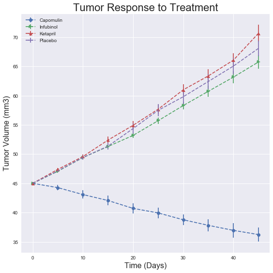
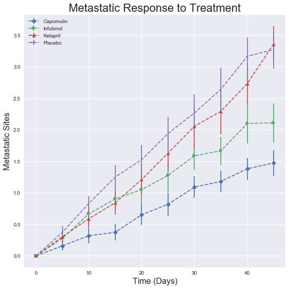
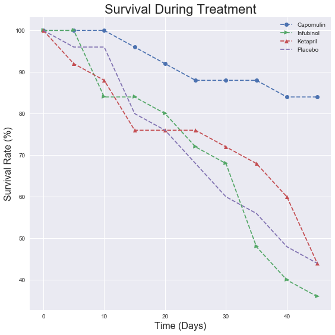
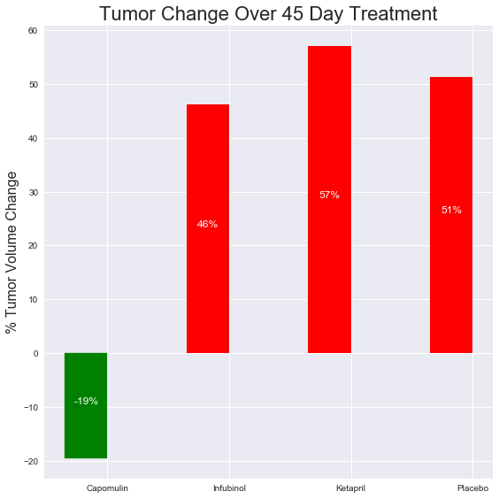

# Analysis

Trends Observed:
* Capomuling is the most promising drug. The tumor volume decreased with time while taking this drug.
* The metastatic sited increased while the mice were taking Capomuling but at the lowest rate among all drugs tested
* The survival rate of Capomulin after 45 days of triasl is 2x better than all the other drugs tested which had survival rates similar to the placebo

Import dependencies


```python
import matplotlib.pyplot as plt
import numpy as np
import os
import pandas as pd
import scipy
import seaborn as sns
sns.set()
```

Load CSV data into pandas DataFrames


```python
drugs_df = pd.read_csv(os.path.join('Resources', 'mouse_drug_data.csv'))
trials_df = pd.read_csv(os.path.join('Resources', 'clinicaltrial_data.csv'))
trials_df = trials_df.merge(drugs_df, how='left', on='Mouse ID')
trials_df.head()
```


<div>
<table border="1" class="dataframe">
  <thead>
    <tr style="text-align: right;">
      <th></th>
      <th>Mouse ID</th>
      <th>Timepoint</th>
      <th>Tumor Volume (mm3)</th>
      <th>Metastatic Sites</th>
      <th>Drug</th>
    </tr>
  </thead>
  <tbody>
    <tr>
      <th>0</th>
      <td>b128</td>
      <td>0</td>
      <td>45.0</td>
      <td>0</td>
      <td>Capomulin</td>
    </tr>
    <tr>
      <th>1</th>
      <td>f932</td>
      <td>0</td>
      <td>45.0</td>
      <td>0</td>
      <td>Ketapril</td>
    </tr>
    <tr>
      <th>2</th>
      <td>g107</td>
      <td>0</td>
      <td>45.0</td>
      <td>0</td>
      <td>Ketapril</td>
    </tr>
    <tr>
      <th>3</th>
      <td>a457</td>
      <td>0</td>
      <td>45.0</td>
      <td>0</td>
      <td>Ketapril</td>
    </tr>
    <tr>
      <th>4</th>
      <td>c819</td>
      <td>0</td>
      <td>45.0</td>
      <td>0</td>
      <td>Ketapril</td>
    </tr>
  </tbody>
</table>
</div>


## Tumor Response to Treatment


```python
drug_response_df = trials_df.pivot_table(values='Tumor Volume (mm3)', index=['Drug','Timepoint'])
drug_response_df
```


<div>
<table border="1" class="dataframe">
  <thead>
    <tr style="text-align: right;">
      <th></th>
      <th></th>
      <th>Tumor Volume (mm3)</th>
    </tr>
    <tr>
      <th>Drug</th>
      <th>Timepoint</th>
      <th></th>
    </tr>
  </thead>
  <tbody>
    <tr>
      <th rowspan="10" valign="top">Capomulin</th>
      <th>0</th>
      <td>45.000000</td>
    </tr>
    <tr>
      <th>5</th>
      <td>44.266086</td>
    </tr>
    <tr>
      <th>10</th>
      <td>43.084291</td>
    </tr>
    <tr>
      <th>15</th>
      <td>42.064317</td>
    </tr>
    <tr>
      <th>20</th>
      <td>40.716325</td>
    </tr>
    <tr>
      <th>25</th>
      <td>39.939528</td>
    </tr>
    <tr>
      <th>30</th>
      <td>38.769339</td>
    </tr>
    <tr>
      <th>35</th>
      <td>37.816839</td>
    </tr>
    <tr>
      <th>40</th>
      <td>36.958001</td>
    </tr>
    <tr>
      <th>45</th>
      <td>36.236114</td>
    </tr>
    <tr>
      <th rowspan="10" valign="top">Ceftamin</th>
      <th>0</th>
      <td>45.000000</td>
    </tr>
    <tr>
      <th>5</th>
      <td>46.503051</td>
    </tr>
    <tr>
      <th>10</th>
      <td>48.285125</td>
    </tr>
    <tr>
      <th>15</th>
      <td>50.094055</td>
    </tr>
    <tr>
      <th>20</th>
      <td>52.157049</td>
    </tr>
    <tr>
      <th>25</th>
      <td>54.287674</td>
    </tr>
    <tr>
      <th>30</th>
      <td>56.769517</td>
    </tr>
    <tr>
      <th>35</th>
      <td>58.827548</td>
    </tr>
    <tr>
      <th>40</th>
      <td>61.467895</td>
    </tr>
    <tr>
      <th>45</th>
      <td>64.132421</td>
    </tr>
    <tr>
      <th rowspan="10" valign="top">Infubinol</th>
      <th>0</th>
      <td>45.000000</td>
    </tr>
    <tr>
      <th>5</th>
      <td>47.062001</td>
    </tr>
    <tr>
      <th>10</th>
      <td>49.403909</td>
    </tr>
    <tr>
      <th>15</th>
      <td>51.296397</td>
    </tr>
    <tr>
      <th>20</th>
      <td>53.197691</td>
    </tr>
    <tr>
      <th>25</th>
      <td>55.715252</td>
    </tr>
    <tr>
      <th>30</th>
      <td>58.299397</td>
    </tr>
    <tr>
      <th>35</th>
      <td>60.742461</td>
    </tr>
    <tr>
      <th>40</th>
      <td>63.162824</td>
    </tr>
    <tr>
      <th>45</th>
      <td>65.755562</td>
    </tr>
    <tr>
      <th>...</th>
      <th>...</th>
      <td>...</td>
    </tr>
    <tr>
      <th rowspan="10" valign="top">Ramicane</th>
      <th>0</th>
      <td>45.000000</td>
    </tr>
    <tr>
      <th>5</th>
      <td>43.944859</td>
    </tr>
    <tr>
      <th>10</th>
      <td>42.531957</td>
    </tr>
    <tr>
      <th>15</th>
      <td>41.495061</td>
    </tr>
    <tr>
      <th>20</th>
      <td>40.238325</td>
    </tr>
    <tr>
      <th>25</th>
      <td>38.974300</td>
    </tr>
    <tr>
      <th>30</th>
      <td>38.703137</td>
    </tr>
    <tr>
      <th>35</th>
      <td>37.451996</td>
    </tr>
    <tr>
      <th>40</th>
      <td>36.574081</td>
    </tr>
    <tr>
      <th>45</th>
      <td>34.955595</td>
    </tr>
    <tr>
      <th rowspan="10" valign="top">Stelasyn</th>
      <th>0</th>
      <td>45.000000</td>
    </tr>
    <tr>
      <th>5</th>
      <td>47.527452</td>
    </tr>
    <tr>
      <th>10</th>
      <td>49.463844</td>
    </tr>
    <tr>
      <th>15</th>
      <td>51.529409</td>
    </tr>
    <tr>
      <th>20</th>
      <td>54.067395</td>
    </tr>
    <tr>
      <th>25</th>
      <td>56.166123</td>
    </tr>
    <tr>
      <th>30</th>
      <td>59.826738</td>
    </tr>
    <tr>
      <th>35</th>
      <td>62.440699</td>
    </tr>
    <tr>
      <th>40</th>
      <td>65.356386</td>
    </tr>
    <tr>
      <th>45</th>
      <td>68.438310</td>
    </tr>
    <tr>
      <th rowspan="10" valign="top">Zoniferol</th>
      <th>0</th>
      <td>45.000000</td>
    </tr>
    <tr>
      <th>5</th>
      <td>46.851818</td>
    </tr>
    <tr>
      <th>10</th>
      <td>48.689881</td>
    </tr>
    <tr>
      <th>15</th>
      <td>50.779059</td>
    </tr>
    <tr>
      <th>20</th>
      <td>53.170334</td>
    </tr>
    <tr>
      <th>25</th>
      <td>55.432935</td>
    </tr>
    <tr>
      <th>30</th>
      <td>57.713531</td>
    </tr>
    <tr>
      <th>35</th>
      <td>60.089372</td>
    </tr>
    <tr>
      <th>40</th>
      <td>62.916692</td>
    </tr>
    <tr>
      <th>45</th>
      <td>65.960888</td>
    </tr>
  </tbody>
</table>
<p>100 rows × 1 columns</p>
</div>


```python
#get mean per drug-timepoint pair
drug_response_mean_df = trials_df.pivot_table(values='Tumor Volume (mm3)', index=['Timepoint'], columns='Drug')
#get standard error of mean per drug-timepoint pair
drug_response_sem_df = trials_df.pivot_table(values='Tumor Volume (mm3)', index=['Timepoint'], columns='Drug',
                                             aggfunc=scipy.stats.sem)
drug_response_mean_df.head()
```


<div>
<table border="1" class="dataframe">
  <thead>
    <tr style="text-align: right;">
      <th>Drug</th>
      <th>Capomulin</th>
      <th>Ceftamin</th>
      <th>Infubinol</th>
      <th>Ketapril</th>
      <th>Naftisol</th>
      <th>Placebo</th>
      <th>Propriva</th>
      <th>Ramicane</th>
      <th>Stelasyn</th>
      <th>Zoniferol</th>
    </tr>
    <tr>
      <th>Timepoint</th>
      <th></th>
      <th></th>
      <th></th>
      <th></th>
      <th></th>
      <th></th>
      <th></th>
      <th></th>
      <th></th>
      <th></th>
    </tr>
  </thead>
  <tbody>
    <tr>
      <th>0</th>
      <td>45.000000</td>
      <td>45.000000</td>
      <td>45.000000</td>
      <td>45.000000</td>
      <td>45.000000</td>
      <td>45.000000</td>
      <td>45.000000</td>
      <td>45.000000</td>
      <td>45.000000</td>
      <td>45.000000</td>
    </tr>
    <tr>
      <th>5</th>
      <td>44.266086</td>
      <td>46.503051</td>
      <td>47.062001</td>
      <td>47.389175</td>
      <td>46.796098</td>
      <td>47.125589</td>
      <td>47.248967</td>
      <td>43.944859</td>
      <td>47.527452</td>
      <td>46.851818</td>
    </tr>
    <tr>
      <th>10</th>
      <td>43.084291</td>
      <td>48.285125</td>
      <td>49.403909</td>
      <td>49.582269</td>
      <td>48.694210</td>
      <td>49.423329</td>
      <td>49.101541</td>
      <td>42.531957</td>
      <td>49.463844</td>
      <td>48.689881</td>
    </tr>
    <tr>
      <th>15</th>
      <td>42.064317</td>
      <td>50.094055</td>
      <td>51.296397</td>
      <td>52.399974</td>
      <td>50.933018</td>
      <td>51.359742</td>
      <td>51.067318</td>
      <td>41.495061</td>
      <td>51.529409</td>
      <td>50.779059</td>
    </tr>
    <tr>
      <th>20</th>
      <td>40.716325</td>
      <td>52.157049</td>
      <td>53.197691</td>
      <td>54.920935</td>
      <td>53.644087</td>
      <td>54.364417</td>
      <td>53.346737</td>
      <td>40.238325</td>
      <td>54.067395</td>
      <td>53.170334</td>
    </tr>
  </tbody>
</table>
</div>


```python
#analyze response to treatment of Capomulin, Infubinol, Ketapril, and Placebo
include_in_analysis = ['Capomulin', 'Infubinol', 'Ketapril',  'Placebo']
fig, ax = plt.subplots(figsize=(8,8))
xaxis = drug_response_sem_df.index
marker_formats = ['--o', '--<', '-->', '--^', '--+', '--x', '--d', '--s', '--p', '--h' ]
ax.set_title('Tumor Response to Treatment', fontsize=22)
ax.set_xlabel('Time (Days)' , fontsize=16)
ax.set_ylabel('Tumor Volume (mm3)', fontsize=16)
for mrkformat,drug in zip(marker_formats,drug_response_mean_df.columns):
    if drug not in include_in_analysis:
        continue
    ax.errorbar(xaxis, drug_response_mean_df[drug], xerr=0.0, yerr = drug_response_sem_df[drug],\
                fmt=mrkformat, label=drug)
plt.legend(loc='best')
plt.tight_layout()
plt.show()
```





## Metastatic Response to Treatment


```python
#get mean per drug-timepoint pair
drug_sites_mean_df = trials_df.pivot_table(values='Metastatic Sites', index=['Timepoint'], columns='Drug')
#get standard error of mean per drug-timepoint pair
drug_sites_sem_df = trials_df.pivot_table(values='Metastatic Sites', index=['Timepoint'], columns='Drug',
                                          aggfunc=scipy.stats.sem)
drug_sites_mean_df.head()
```


<div>
<table border="1" class="dataframe">
  <thead>
    <tr style="text-align: right;">
      <th>Drug</th>
      <th>Capomulin</th>
      <th>Ceftamin</th>
      <th>Infubinol</th>
      <th>Ketapril</th>
      <th>Naftisol</th>
      <th>Placebo</th>
      <th>Propriva</th>
      <th>Ramicane</th>
      <th>Stelasyn</th>
      <th>Zoniferol</th>
    </tr>
    <tr>
      <th>Timepoint</th>
      <th></th>
      <th></th>
      <th></th>
      <th></th>
      <th></th>
      <th></th>
      <th></th>
      <th></th>
      <th></th>
      <th></th>
    </tr>
  </thead>
  <tbody>
    <tr>
      <th>0</th>
      <td>0.000000</td>
      <td>0.000000</td>
      <td>0.000000</td>
      <td>0.000000</td>
      <td>0.000000</td>
      <td>0.000000</td>
      <td>0.000000</td>
      <td>0.000000</td>
      <td>0.000000</td>
      <td>0.000000</td>
    </tr>
    <tr>
      <th>5</th>
      <td>0.160000</td>
      <td>0.380952</td>
      <td>0.280000</td>
      <td>0.304348</td>
      <td>0.260870</td>
      <td>0.375000</td>
      <td>0.320000</td>
      <td>0.120000</td>
      <td>0.240000</td>
      <td>0.166667</td>
    </tr>
    <tr>
      <th>10</th>
      <td>0.320000</td>
      <td>0.600000</td>
      <td>0.666667</td>
      <td>0.590909</td>
      <td>0.523810</td>
      <td>0.833333</td>
      <td>0.565217</td>
      <td>0.250000</td>
      <td>0.478261</td>
      <td>0.500000</td>
    </tr>
    <tr>
      <th>15</th>
      <td>0.375000</td>
      <td>0.789474</td>
      <td>0.904762</td>
      <td>0.842105</td>
      <td>0.857143</td>
      <td>1.250000</td>
      <td>0.764706</td>
      <td>0.333333</td>
      <td>0.782609</td>
      <td>0.809524</td>
    </tr>
    <tr>
      <th>20</th>
      <td>0.652174</td>
      <td>1.111111</td>
      <td>1.050000</td>
      <td>1.210526</td>
      <td>1.150000</td>
      <td>1.526316</td>
      <td>1.000000</td>
      <td>0.347826</td>
      <td>0.952381</td>
      <td>1.294118</td>
    </tr>
  </tbody>
</table>
</div>


```python
fig, ax = plt.subplots(figsize=(8,8))
ax.set_title('Metastatic Response to Treatment', fontsize=22)
ax.set_xlabel('Time (Days)' , fontsize=16)
ax.set_ylabel('Metastatic Sites', fontsize=16)
for mrkformat,drug in zip(marker_formats,drug_sites_mean_df.columns):
    if drug not in include_in_analysis:
        continue
    ax.errorbar(xaxis, drug_sites_mean_df[drug], xerr=0.0, yerr = drug_sites_sem_df[drug],\
                fmt=mrkformat, label=drug)
plt.legend(loc='best')
plt.tight_layout()
plt.show()
```





## Survival Rates


```python
#get count per drug-timepoint pair
survive_count_df = trials_df.pivot_table(values='Mouse ID', index=['Timepoint'], columns='Drug',aggfunc=np.count_nonzero)
survive_count_df.head()
```


<div>
<table border="1" class="dataframe">
  <thead>
    <tr style="text-align: right;">
      <th>Drug</th>
      <th>Capomulin</th>
      <th>Ceftamin</th>
      <th>Infubinol</th>
      <th>Ketapril</th>
      <th>Naftisol</th>
      <th>Placebo</th>
      <th>Propriva</th>
      <th>Ramicane</th>
      <th>Stelasyn</th>
      <th>Zoniferol</th>
    </tr>
    <tr>
      <th>Timepoint</th>
      <th></th>
      <th></th>
      <th></th>
      <th></th>
      <th></th>
      <th></th>
      <th></th>
      <th></th>
      <th></th>
      <th></th>
    </tr>
  </thead>
  <tbody>
    <tr>
      <th>0</th>
      <td>25</td>
      <td>25</td>
      <td>25</td>
      <td>25</td>
      <td>25</td>
      <td>25</td>
      <td>26</td>
      <td>25</td>
      <td>26</td>
      <td>25</td>
    </tr>
    <tr>
      <th>5</th>
      <td>25</td>
      <td>21</td>
      <td>25</td>
      <td>23</td>
      <td>23</td>
      <td>24</td>
      <td>25</td>
      <td>25</td>
      <td>25</td>
      <td>24</td>
    </tr>
    <tr>
      <th>10</th>
      <td>25</td>
      <td>20</td>
      <td>21</td>
      <td>22</td>
      <td>21</td>
      <td>24</td>
      <td>23</td>
      <td>24</td>
      <td>23</td>
      <td>22</td>
    </tr>
    <tr>
      <th>15</th>
      <td>24</td>
      <td>19</td>
      <td>21</td>
      <td>19</td>
      <td>21</td>
      <td>20</td>
      <td>17</td>
      <td>24</td>
      <td>23</td>
      <td>21</td>
    </tr>
    <tr>
      <th>20</th>
      <td>23</td>
      <td>18</td>
      <td>20</td>
      <td>19</td>
      <td>20</td>
      <td>19</td>
      <td>17</td>
      <td>23</td>
      <td>21</td>
      <td>17</td>
    </tr>
  </tbody>
</table>
</div>


```python
#get percentage per drug-timepoint pair (initial value in time is 100%)
survive_count_df = 100*survive_count_df/25
#Propriva and Stelasyn have max of 26 not 25
survive_count_df[['Propriva','Stelasyn']] = survive_count_df[['Propriva','Stelasyn']]*25/26
survive_count_df = survive_count_df.applymap( lambda x: round(x,2))
survive_count_df.head()
```


<div>
<table border="1" class="dataframe">
  <thead>
    <tr style="text-align: right;">
      <th>Drug</th>
      <th>Capomulin</th>
      <th>Ceftamin</th>
      <th>Infubinol</th>
      <th>Ketapril</th>
      <th>Naftisol</th>
      <th>Placebo</th>
      <th>Propriva</th>
      <th>Ramicane</th>
      <th>Stelasyn</th>
      <th>Zoniferol</th>
    </tr>
    <tr>
      <th>Timepoint</th>
      <th></th>
      <th></th>
      <th></th>
      <th></th>
      <th></th>
      <th></th>
      <th></th>
      <th></th>
      <th></th>
      <th></th>
    </tr>
  </thead>
  <tbody>
    <tr>
      <th>0</th>
      <td>100.0</td>
      <td>100.0</td>
      <td>100.0</td>
      <td>100.0</td>
      <td>100.0</td>
      <td>100.0</td>
      <td>100.00</td>
      <td>100.0</td>
      <td>100.00</td>
      <td>100.0</td>
    </tr>
    <tr>
      <th>5</th>
      <td>100.0</td>
      <td>84.0</td>
      <td>100.0</td>
      <td>92.0</td>
      <td>92.0</td>
      <td>96.0</td>
      <td>96.15</td>
      <td>100.0</td>
      <td>96.15</td>
      <td>96.0</td>
    </tr>
    <tr>
      <th>10</th>
      <td>100.0</td>
      <td>80.0</td>
      <td>84.0</td>
      <td>88.0</td>
      <td>84.0</td>
      <td>96.0</td>
      <td>88.46</td>
      <td>96.0</td>
      <td>88.46</td>
      <td>88.0</td>
    </tr>
    <tr>
      <th>15</th>
      <td>96.0</td>
      <td>76.0</td>
      <td>84.0</td>
      <td>76.0</td>
      <td>84.0</td>
      <td>80.0</td>
      <td>65.38</td>
      <td>96.0</td>
      <td>88.46</td>
      <td>84.0</td>
    </tr>
    <tr>
      <th>20</th>
      <td>92.0</td>
      <td>72.0</td>
      <td>80.0</td>
      <td>76.0</td>
      <td>80.0</td>
      <td>76.0</td>
      <td>65.38</td>
      <td>92.0</td>
      <td>80.77</td>
      <td>68.0</td>
    </tr>
  </tbody>
</table>
</div>


```python
fig, ax = plt.subplots(figsize=(8,8))
ax.set_title('Survival During Treatment', fontsize=22)
ax.set_xlabel('Time (Days)' , fontsize=16)
ax.set_ylabel('Survival Rate (%)', fontsize=16)
for mrkformat,drug in zip(marker_formats,survive_count_df.columns):
    if drug not in include_in_analysis:
        continue
    ax.plot(xaxis, survive_count_df[drug],mrkformat, label=drug)
plt.legend(loc='best')
plt.tight_layout()
plt.show()
```





## Summary Bar Graph


```python
#get volume %change
vol_percent_change = (100*(drug_response_mean_df.iloc[-1,:] - drug_response_mean_df.iloc[0,:])/drug_response_mean_df.iloc[0,:])
vol_percent_change = vol_percent_change.loc[include_in_analysis]
vol_percent_change
```


    Drug
    Capomulin   -19.475303
    Infubinol    46.123472
    Ketapril     57.028795
    Placebo      51.297960
    dtype: float64


```python
fig, ax = plt.subplots(figsize=(8,8))
#set number of items to plot
ind = np.arange(len(include_in_analysis))
#set widht of bars to plot
width = 0.35
ax.set_title('Tumor Change Over 45 Day Treatment', fontsize=22)
ax.set_xticklabels(include_in_analysis)
ax.set_ylabel('% Tumor Volume Change', fontsize=16)
ax.set_xticks(ind + width / 2)
#plot bars
bars = ax.bar(ind, vol_percent_change.values, width, color='r')
#change color of Capomulin since volume ot tumor decreased
bars[0].set_color('g')
plt.legend(loc='best')
plt.tight_layout()

for bar in bars:
        #write labels at half height of bars
        label_position = .5*bar.get_height()
        ax.text(bar.get_x() + bar.get_width()/2.,
                label_position, f'{int(bar.get_height())}%',
                ha='center', va='bottom', color='w')

plt.show()
```



