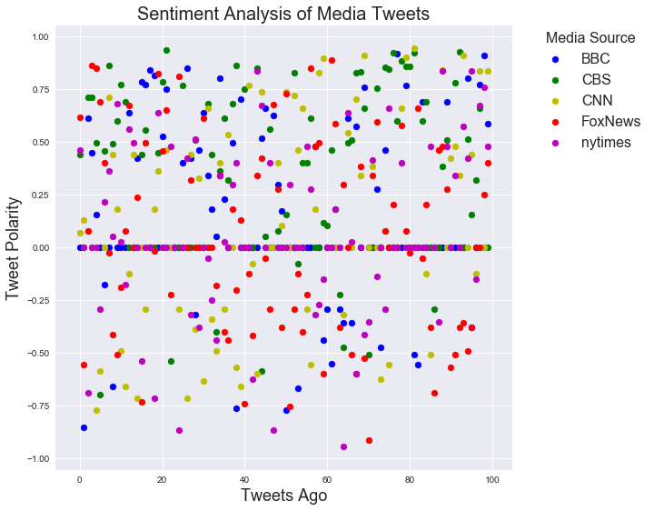
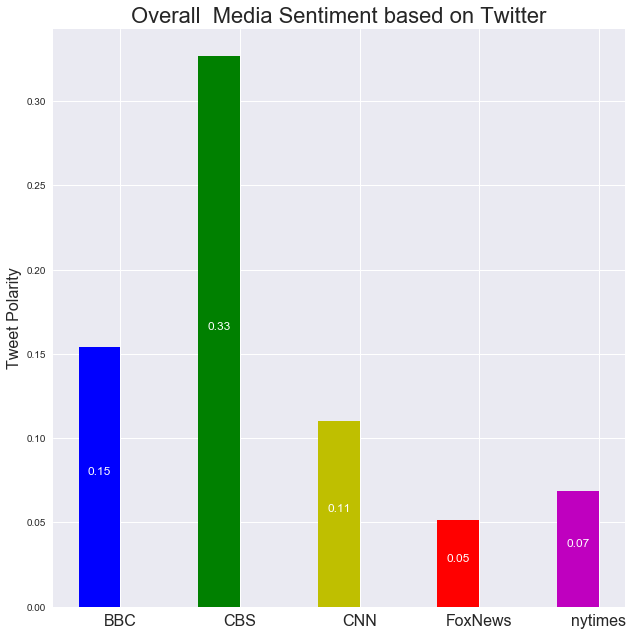

# VADER Sentiment Analysis on Twitter Accounts of News Outlets

## Observed trends:
* CBS happened to have the most positive sentiment measure in its tweets for the range sampler
* The difference in sentiment compound score between the most positive outler (CBS) and the least positive outlet (Fox) is 6x
* There is no visible temporal trend for any media outlet 

Dependencies


```python
import config
import json
import matplotlib.pyplot as plt
import numpy as np
import pandas as pd
import tweepy
import seaborn as sns
from vaderSentiment.vaderSentiment import SentimentIntensityAnalyzer

sns.set()
```

Twitter API Keys


```python
consumer_key = config.consumer_key
consumer_secret = config.consumer_secret
access_token = config.access_token
access_token_secret = config.access_token_secret
```

Setup Tweepy API Authentication


```python
auth = tweepy.OAuthHandler(consumer_key, consumer_secret)
auth.set_access_token(access_token, access_token_secret)
api = tweepy.API(auth)
```

List of media outlets to analyze


```python
news_outlets = ['BBC', 'CBS', 'CNN', 'FoxNews', 'nytimes']
```

Setup instance of VADER analyzer


```python
analyzer = SentimentIntensityAnalyzer()
```

Loop over each outlet, outlet's tweets and perform sentiment analysis on each tweet

Save the per-tweet results in a pandas DataFrame


```python
sentiment_df = pd.DataFrame(columns=['Source', 'Text', 'Date', 'Compound Score', 'Positive Score', 'Neutral Score', 
                                    'Negative Score'])
current_df_indx = 0
for target_user in news_outlets:
    for page in tweepy.Cursor(api.user_timeline, id=target_user).pages(5):
            for tweet in page:
                tweet_text = json.dumps(tweet._json, indent=3)
                tweet = json.loads(tweet_text)

                # Parse the tweet to identify its text and date
                tweet_text = tweet["text"]
                tweet_date = tweet["created_at"]

                # Analyze the sentiment of the tweet
                compound = analyzer.polarity_scores(tweet_text)["compound"]
                pos = analyzer.polarity_scores(tweet_text)["pos"]
                neu = analyzer.polarity_scores(tweet_text)["neu"]
                neg = analyzer.polarity_scores(tweet_text)["neg"]

                # Add the sentiment analyses to the dataframe
                sentiment_df.loc[current_df_indx, 'Source'] = target_user
                sentiment_df.loc[current_df_indx, 'Text'] = tweet_text
                sentiment_df.loc[current_df_indx, 'Date'] = tweet_date
                sentiment_df.loc[current_df_indx, 'Compound Score'] = compound
                sentiment_df.loc[current_df_indx, 'Positive Score'] = pos
                sentiment_df.loc[current_df_indx, 'Neutral Score'] = neu
                sentiment_df.loc[current_df_indx, 'Negative Score'] = neg
                                
                current_df_indx = current_df_indx + 1
```


```python
sentiment_df.head()
```


<div>
<style>
    .dataframe thead tr:only-child th {
        text-align: right;
    }

    .dataframe thead th {
        text-align: left;
    }

    .dataframe tbody tr th {
        vertical-align: top;
    }
</style>
<table border="1" class="dataframe">
  <thead>
    <tr style="text-align: right;">
      <th></th>
      <th>Source</th>
      <th>Text</th>
      <th>Date</th>
      <th>Compound Score</th>
      <th>Positive Score</th>
      <th>Neutral Score</th>
      <th>Negative Score</th>
    </tr>
  </thead>
  <tbody>
    <tr>
      <th>0</th>
      <td>BBC</td>
      <td>😂 Who actually watched the #Oscars? https://t....</td>
      <td>Mon Mar 05 19:30:07 +0000 2018</td>
      <td>0</td>
      <td>0</td>
      <td>1</td>
      <td>0</td>
    </tr>
    <tr>
      <th>1</th>
      <td>BBC</td>
      <td>No meat. No fish. No eggs. No milk. No cheese....</td>
      <td>Mon Mar 05 18:38:04 +0000 2018</td>
      <td>-0.8555</td>
      <td>0</td>
      <td>0.592</td>
      <td>0.408</td>
    </tr>
    <tr>
      <th>2</th>
      <td>BBC</td>
      <td>Like father, like daughter.\n\n😂🔥 @GordonRamsa...</td>
      <td>Mon Mar 05 17:23:22 +0000 2018</td>
      <td>0.6124</td>
      <td>0.263</td>
      <td>0.737</td>
      <td>0</td>
    </tr>
    <tr>
      <th>3</th>
      <td>BBC</td>
      <td>RT @BBCFOUR: The little mouse that inspired Pi...</td>
      <td>Mon Mar 05 17:15:34 +0000 2018</td>
      <td>0.4472</td>
      <td>0.211</td>
      <td>0.789</td>
      <td>0</td>
    </tr>
    <tr>
      <th>4</th>
      <td>BBC</td>
      <td>"I made a promise to our six-year-old lead act...</td>
      <td>Mon Mar 05 17:00:31 +0000 2018</td>
      <td>0.1531</td>
      <td>0.105</td>
      <td>0.818</td>
      <td>0.077</td>
    </tr>
  </tbody>
</table>
</div>


Export VADER sentiment analysis of tweets to a csv file


```python
sentiment_df.to_csv('news_mood.csv')
```


```python
fig, ax = plt.subplots(figsize = (9, 9))
outlet_colors = ['b', 'g', 'y', 'r', 'm']
for outlet, color in zip(news_outlets, outlet_colors):
    tweets_order = range(len(sentiment_df[sentiment_df['Source'] == outlet]))
    ax.scatter(tweets_order, sentiment_df[sentiment_df['Source'] == outlet]['Compound Score'], label=outlet, color=color )
ax.set_xlabel('Tweets Ago', fontsize=18)
ax.set_ylabel('Tweet Polarity', fontsize=18)
ax.set_title('Sentiment Analysis of Media Tweets', fontsize=20)
legend = ax.legend(bbox_to_anchor=(1.05, 1), loc=2, borderaxespad=0, fontsize=16,title='Media Source')
plt.setp(legend.get_title(),fontsize=16)
plt.savefig('sentiment_media_tweets.png')
plt.show()
```





Overall organization sentiments for last 100 tweets


```python
sentiment_gp = sentiment_df.groupby('Source')
overall_sentiments = sentiment_gp['Compound Score'].sum()/sentiment_gp['Compound Score'].count()
overall_sentiments
```


    Source
    BBC        0.153997
    CBS        0.326577
    CNN        0.110366
    FoxNews    0.051630
    nytimes    0.068555
    Name: Compound Score, dtype: float64


```python
fig, ax = plt.subplots(figsize=(9, 9))
#set number of items to plot
ind = np.arange(len(news_outlets))
#set widht of bars to plot
width = 0.35
ax.set_title('Overall  Media Sentiment based on Twitter', fontsize=22)
ax.set_xticklabels(news_outlets, fontsize = 16)
ax.set_ylabel('Tweet Polarity', fontsize=16)
ax.set_xticks(ind + width / 2)
#plot bars
bars = ax.bar(ind, overall_sentiments, width, color=outlet_colors)
plt.legend(loc='best')
plt.tight_layout()

for bar in bars:
        #write labels at half height of bars
        label_position = .5*bar.get_height()
        ax.text(bar.get_x() + bar.get_width()/2.,
                label_position, f'{bar.get_height():0.2f}',
                ha='center', va='bottom', color='w')
plt.savefig('overall_sentiment_media.png')
plt.show()
```




